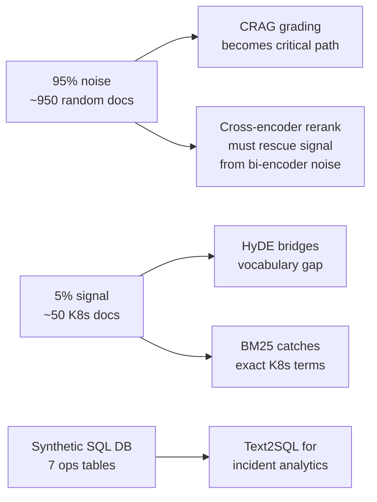

# ADV RAG Changelog

All notable changes to this project will be documented in this file.

The format is based on [Keep a Changelog](https://keepachangelog.com/en/1.1.0/),
and this project uses phase-based milestones instead of semantic versioning.

## [Unreleased] — 2026-05-16

### BREAKING: Pivoted knowledge base from e-commerce to K8s IT-Ops with noisy corpus

**What changed**

- Domain: e-commerce customer support → Kubernetes IT-Operations copilot
- Knowledge base: 5 tiny policy PDFs (~120 KB) → ~1000 docs (~170 MB total)
  - 50 "true" docs = Kubernetes official documentation (~30 MB, the **signal**)
  - 950 "noisy" docs = random PDFs/DOCX/TXT/HTML from `github.com/tpn/pdfs` (~120 MB, the **noise**)
  - 95% noise / 5% signal ratio — mirrors a real corporate knowledge base
- SQL schema: `customers / orders / products` → `clusters / nodes / pods / deployments / incidents / alerts / oncall_logs` (~20 MB synthetic ops data)
- Seed docs: `refund-policy.pdf`, `shipping-policy.pdf`, `warranty.pdf` → K8s runbooks and architecture docs
- Example queries updated throughout PRD (e-commerce → K8s ops flavour)

**Why**

The original corpus was too small and too clean to demonstrate the value of advanced RAG. At 95% noise ratio, every technique has to earn its keep:

**Migration impact**

- Architecture: **untouched** — HyDE, CRAG, Self-RAG, hybrid search, reranking, security layers, LangGraph, caching topology all unchanged
- Code changes: ~0 lines of `app/` code (domain-agnostic throughout)
- Content pipeline: `scripts/data_pipeline/` — new scripts to fetch K8s docs, sample tpn/pdfs noise, generate synthetic SQL data (~15 hrs)
- Eval golden questions: `seed/eval/` — update 50 questions from e-commerce to K8s ops (~3 hrs)
- Seed data: `seed/docs/` and `seed/postgres_seed.sql` replacement (~2 hrs)
- Total estimated rework: **~20 hrs** (content, not architecture)

---

## [phase-0-baseline] — TBD

### Added
- JWT auth + bcrypt password hashing
- Sliding-window rate limit (per-user; per-IP for /auth/*)
- Token budget per user/day
- Pydantic input validation + regex pre-filter
- Hardened system prompt (K8s IT-Ops domain)
- Output schema validation with retry-with-LLM-error
- Spotlighting wrapper

## [phase-1-skeleton] — TBD

### Added
- FastAPI app with /query, /documents/upload, /admin/health endpoints
- LangGraph orchestration (route_intent -> generate_answer skeleton)
- Postgres + Qdrant docker-compose for local dev
- Vanna 2.0 wrapper with information_schema introspection
- Naive RAG path (embed -> cosine top-k -> spotlight -> generate)
