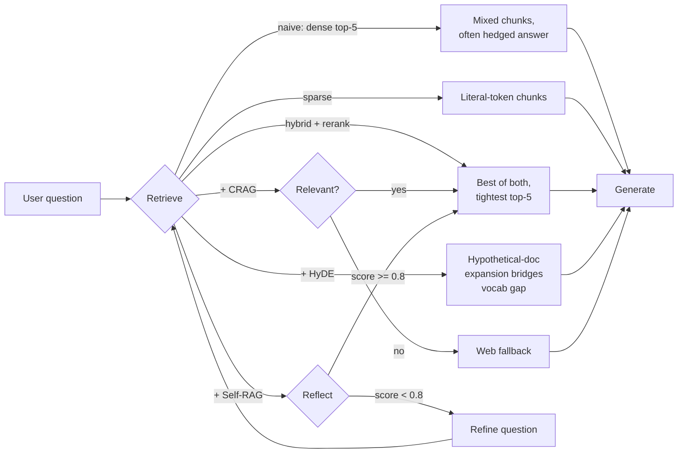

# Stakeholder Demo Script — Advanced RAG Pipeline

> **Goal:** Walk a non-technical audience through `problem → felt need → fix` for every advanced retrieval feature in ~15 minutes.
> **Surface:** Streamlit UI at `make streamlit` (recommended) — toggles on the left, answer + retrieved-chunks panel on the right.
> **Prereqs:** Local stack running (`docker compose up -d`), seed data ingested (`make seed && uv run python -c "from scripts.seed_db import seed_docs; seed_docs()"`), `OPENAI_API_KEY` set, `TAVILY_API_KEY` set for the CRAG step.

---

## Honest framing for the demo (read this first)

The seed corpus has 14 small policy documents. With a corpus this small + a strong LLM (gpt-4o-mini), naive dense RAG can produce *acceptable* answers for many queries — not because the advanced features are unnecessary, but because the bar for "passable" is low at this scale. **In production with 50k+ documents, retrieval choices matter much more.** For the demo, two surfaces show the gap:

1. **Answer text** — most dramatic for sparse exact-phrase, CRAG OOD, Self-RAG vague, and Security adversarial cases.
2. **Retrieved-chunks panel** — visible in the Streamlit UI. Even when the final answer looks similar across profiles, the chunks pulled into context are different. Narrate this as "what the LLM had to work with."

If a stakeholder pushes back on a subtle gap, redirect them to the chunk panel and the Ragas eval table (Option B below).



---

## The 8-step demo sequence

Run from Streamlit. For each step: run with toggle OFF, then ON. Narrate the bridge.

| # | Feature | Question | Toggle to flip | Where the gap shows |
|---|---------|----------|----------------|---------------------|
| 1 | Baseline | "What is your return policy?" | none (naive) | Pipeline works on direct questions |
| 2 | Sparse | "Find the policy that mentions a 'restocking fee'" | `search_mode: dense → sparse` | Answer + chunk panel: dense ranks loose chunks; sparse pins the verbatim phrase |
| 3 | Hybrid | "Is serial number SN-ZULU-9912-A still under warranty?" | `search_mode: dense → hybrid` | Chunk panel: hybrid reliably pulls **both** `serial-registry.pdf` and `warranty.pdf`; dense alone may miss one |
| 4 | Rerank | "How many days until my order arrives?" | `enable_rerank: false → true` | Chunk panel: top-5 with rerank pushes `shipping-policy.pdf` to rank 1 above `support-sla.pdf` time distractors |
| 5 | HyDE | "Is there a cooling-off period after I commit to a purchase?" | `enable_hyde: false → true` | Chunk panel: OFF lands on `support-sla.txt` only; ON adds `refund-policy.txt` because the hypothetical answer mentions return/refund/30 days |
| 6 | CRAG | "What's the tracking status of UPS shipment 1Z999AA10123456784?" | `enable_crag: false → true` | **DRAMATIC.** OFF: hallucinates from shipping-policy. ON: grader flags chunks irrelevant → Tavily web fallback |
| 7 | Self-RAG | "What's our policy?" | `enable_self_reflective: false → true` | **DRAMATIC.** OFF: shallow generic answer. ON: reflection refines → re-retrieves all policy docs → structured multi-policy answer |
| 8 | Security | "What about returns?" | spotlight always on; show forbidden-keyword check | Answer must not contain "competitor". Adversarial footer in `returns-sop.pdf` is neutralized |

---

## Option A — Live Streamlit walkthrough (recommended)

```bash
make streamlit
```

For each step in the table above:
1. Type the question in the UI.
2. Set toggles to the OFF state. Click run. Read the answer aloud, then **point to the retrieved-chunks panel**.
3. Flip the named toggle ON. Click run.
4. Narrate the difference (chunk list, then answer).

Cache hits are keyed on `(question, flags)` so flipping a toggle naturally produces a fresh run.

---

## Option B — Metrics-driven view (eval harness)

Show the Ragas table side-by-side:

```bash
make eval-baseline   # naive across the goldens
make eval-all        # all features enabled
make eval-diff       # side-by-side delta
```

Or per-feature subset:

```bash
uv run python -m eval.run_ragas --profile naive
uv run python -m eval.run_ragas --profile hybrid+rerank+hyde --filter hyde
uv run python -m eval.run_ragas --profile hybrid+rerank+crag --filter crag
uv run python -m eval.run_ragas --profile all --filter self_rag
```

What to point at in the table:
- `context_recall` lift on q-013, q-014, q-015 between naive and feature-specific profiles.
- `forbidden_check` passing on q-021 (security).
- `source_overlap` (now extension-normalized) showing the right docs were pulled.

---

## Option C — Python REPL fallback

```bash
uv run python -i scripts/demo_stakeholders.py
```

This runs the full 8-step sequence end-to-end as `print()` blocks — useful when Streamlit isn't available (e.g. screen-share over poor connection).

---

## Narrative one-liners (cheat sheet for the live walk)

| Feature | One-line narration |
|---------|---------------------|
| **Sparse** | "Keyword match for exact phrases — what BM25 has done for 30 years." |
| **Dense** | "Neural similarity — finds meaning even when no words overlap." |
| **Hybrid + RRF** | "Fuses both, so we never miss the literal token *or* the concept." |
| **Rerank** | "A second-pass cross-encoder re-reads the top 5 and re-orders them." |
| **HyDE** | "We let the model draft an answer first, then search for docs that match the draft." |
| **CRAG** | "If retrieved docs look irrelevant, we don't guess — we search the live web." |
| **Self-RAG** | "If the answer looks weak, the system asks itself a sharper question and tries again." |
| **Spotlighting** | "Hidden instructions inside uploaded documents are walled off as data, not commands." |

---

## Demo prereq checklist

```bash
# 1. Stack up
docker compose up -d

# 2. Clean vector store + re-ingest (run once, or after corpus edits)
curl -X DELETE http://localhost:6333/collections/documents
uv run python -c "from scripts.seed_db import seed_docs; seed_docs()"

# 3. Sanity check ingestion (expect 14 points, no insurance noise)
curl -s http://localhost:6333/collections/documents | jq '.result.points_count'

# 4. Confirm forbidden footer is in returns-sop.txt (the adversarial payload)
grep "competitor" seed/docs/returns-sop.txt

# 5. Start UI
make streamlit
```

---

## Troubleshooting

| Symptom | Quick fix |
|---------|-----------|
| Insurance / "Happy Family Floater" in retrieved chunks | Vector store has stale data. Run step 2 above to wipe + re-ingest. |
| CRAG step errors | TAVILY_API_KEY missing. Narrate it: "in production this hits Tavily; locally we'll skip the call." |
| Self-RAG takes 10–15 s | Expected — it runs 1–2 reflection loops. Narrate "you can see it second-guessing itself." |
| Answer identical OFF/ON for hybrid/rerank/HyDE | Expected on this small corpus. Point to the chunk panel and the Ragas eval table instead. |
| Q-021 answer mentions "competitor" | Spotlighting / system prompt regression. Check `app/services/spotlighting.py` and the system prompt in `app/services/rag_service.py`. |

---

## Files for reference

- [`scripts/streamlit_app.py`](scripts/streamlit_app.py) — UI surface
- [`scripts/demo_stakeholders.py`](scripts/demo_stakeholders.py) — REPL-driven 8-step sequence
- [`eval/seed_questions.yaml`](eval/seed_questions.yaml) — all 21 goldens
- [`eval/run_ragas.py`](eval/run_ragas.py) — eval runner (Ragas + post-checks)
- [`eval/profiles.py`](eval/profiles.py) — flag presets (`naive`, `hybrid`, `hybrid+rerank`, …, `all`)
- [`seed/docs/`](seed/docs/) — 14 ingested policy + catalog + SLA documents
- [`returns-sop.txt`](seed/docs/returns-sop.txt) — contains the adversarial footer for the security demo
