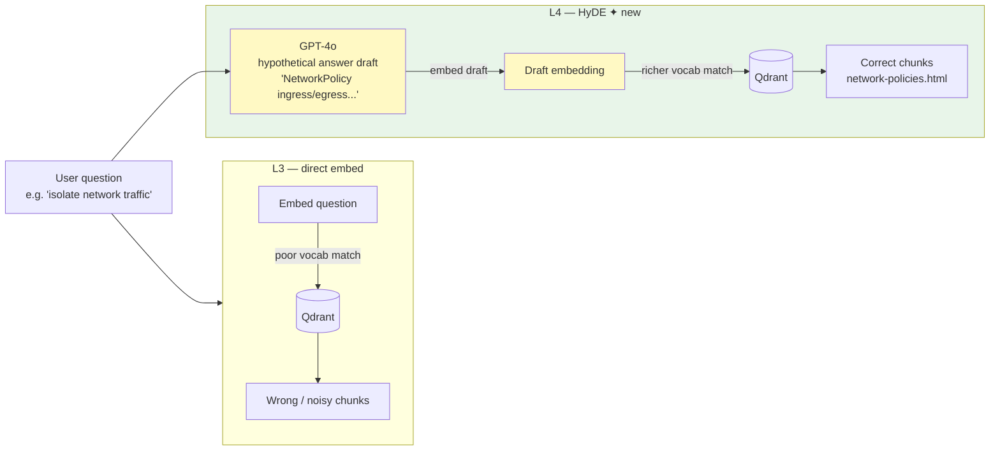

# Lesson 4 — HyDE (Hypothetical Document Embeddings)

> **Eval target:** 55% → 65%
> **Branch:** `lesson-4-hyde`  ·  **Previous lesson:** `lesson-3-reranking`

## What you'll build

`HyDERetriever` in `app/services/hyde.py`: given the user's question, use GPT-4o to draft a short hypothetical answer (2–3 sentences), embed that answer with OpenAI embeddings, and retrieve the top-k chunks closest to the *draft* — not the original question. The hypothetical answer uses the same vocabulary as the documentation, bridging the gap between how users ask and how docs are written.

## Why this feature — the pain from last lesson

After L3, golden questions q-011 and q-012 still fail. `"Is there a way to isolate network traffic between services in a cluster?"` contains zero tokens that appear in `network-policies.html` — the corpus uses "NetworkPolicy", "ingress rules", "egress". The hybrid retriever embeds the question directly; the resulting vector lands in a sparse region of the embedding space far from the K8s documentation. HyDE generates a draft mentioning "NetworkPolicy" and "ingress/egress rules", and *that* embedding lands right next to the relevant docs.

## Pipeline diagram (before → after)



## Files you're adding

- `tests/unit/test_hyde.py`
- `eval/results/lesson-4-baseline.json`

## Files you're modifying

- `app/services/hyde.py` — `HyDERetriever.retrieve()` (already present; trace the pipeline)
- `app/services/rag_service.py` — step 1 in `_retrieve()` checks `if enable_hyde: chunks = HyDERetriever().retrieve(...)`
- `app/models.py` — `enable_hyde: bool = False` (students flip to `True`)

## Step-by-step build

1. **Read `HyDERetriever.retrieve()` in `hyde.py`.**
   The full pipeline in the existing code:
   ```python
   # 1. Generate N hypothetical answers
   for _ in range(self.num_hypotheses):
       hypothesis = generate(system_prompt=_HYDE_SYSTEM_PROMPT, user_message=question, ...)
       hypotheses.append(hypothesis)
   # 2. Embed all hypotheses + original question
   all_texts = hypotheses + [question]
   embeddings = embed_texts(all_texts)
   # 3. Retrieve for each embedding, merge and deduplicate
   ```
   `num_hypotheses` defaults to `settings.hyde_num_hypotheses` (typically `1`).

2. **Confirm the HyDE branch is first in `_retrieve()`.**
   ```python
   if enable_hyde:
       chunks = HyDERetriever().retrieve(question, top_k=top_k)
   elif search_mode == "hybrid":
       ...
   ```
   HyDE takes priority and uses its own internal `search()` call (dense only) — it does not go through the hybrid path. This is by design: the hypothetical embedding already captures vocabulary; BM25 on the hypothesis would double-count.

3. **Write a unit test confirming the hypothesis is embedded, not the raw question.**
   Create `tests/unit/test_hyde.py`:
   ```python
   from unittest.mock import patch, MagicMock
   from app.services.hyde import HyDERetriever

   def test_hyde_embeds_hypothesis_not_question():
       retriever = HyDERetriever(num_hypotheses=1)
       with patch("app.services.hyde.generate") as mg, \
            patch("app.services.hyde.embed_texts") as me, \
            patch("app.services.hyde.search") as ms:
           mg.return_value = {"text": "Kubernetes NetworkPolicy controls traffic."}
           me.return_value = [[0.1] * 1536, [0.2] * 1536]
           ms.return_value = []
           retriever.retrieve("isolate network traffic")
           # embed_texts should receive [hypothesis, question], not just [question]
           args = me.call_args[0][0]
           assert any("NetworkPolicy" in t for t in args)
   ```
   Run: `uv run pytest tests/unit/test_hyde.py -v`

4. **Demo the vocab gap visually in the Streamlit UI.**
   Open `make streamlit`, enable HyDE toggle, run:
   ```
   How do I make sure my app keeps running even if a server dies?
   ```
   With HyDE OFF: sources include `connect-applications-service.docx`, `basic-stateful-set.html`.
   With HyDE ON: sources switch to `deploy-app__deploy-intro.txt`, `scale__scale-intro.html`.

5. **Run eval for HyDE and save the artifact.**
   ```bash
   make eval-hyde
   # runs: uv run python -m eval.run_ragas --profile hybrid+rerank+hyde --filter hyde
   cp eval/results/$(ls -t eval/results/*_hybrid+rerank+hyde.json | head -1 | xargs basename) \
      eval/results/lesson-4-baseline.json
   ```

## Verification

### Quick smoke test

```bash
curl -sX POST http://localhost:8000/query \
  -H "Authorization: Bearer $TOKEN" \
  -H "Content-Type: application/json" \
  -d '{
    "question": "How do I make sure my app keeps running even if a server dies?",
    "search_mode": "hybrid",
    "enable_hyde": true,
    "enable_rerank": true,
    "enable_crag": false,
    "enable_self_reflective": false,
    "top_k": 5
  }' | jq '.sources, .metadata.latency_ms'
```

Expected:
- Sources include `deploy-app__deploy-intro.txt` and/or `scale__scale-intro.html`
- Latency ~15 000 ms (extra LLM call for hypothesis generation)

With `enable_hyde: false` and same flags, sources drift to `connect-applications-service.docx`. The difference is the HyDE hypothesis mentioning "replicas, deployments, automatic scaling."

### Eval check

```bash
make eval-hyde
uv run python -m eval.run_ragas --profile hybrid+rerank+hyde --filter hyde
```

Expected: `context_recall ~65%` on the `hyde`-tagged golden questions (q-011, q-012). Compare:

```bash
uv run python -m eval.diff \
  eval/results/lesson-3-baseline.json \
  eval/results/lesson-4-baseline.json
```

Expected: recall on the paraphrase/vague subset `+10pp`. Latency increase: `+2–5 s` per query (one extra LLM call).

## What's next

L5 adds CRAG (Corrective RAG). Even with HyDE, questions about things *not in the corpus* (like "what are the new features in Kubernetes 1.34?") will retrieve irrelevant chunks and the LLM will either hallucinate or hedge. CRAG grades the chunks before generation — if they score below the relevance threshold, it falls back to Tavily web search. Eval jumps to ~78%.

## References

- `DEMO_VIDEO_SCRIPT.md` section 5 (HyDE demo, server-dies query)
- `eval/profiles.py` — `hybrid+rerank+hyde` profile
- `app/services/hyde.py` — `HyDERetriever`
- Gao et al. (2022) — "Precise Zero-Shot Dense Retrieval without Relevance Labels" (HyDE paper)
