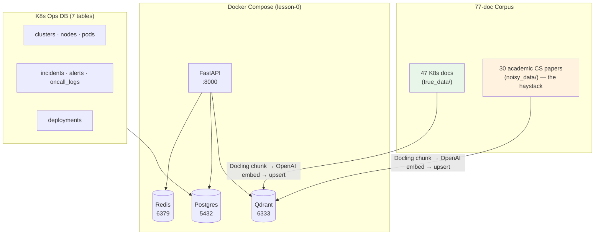

# Lesson 0 — Setup (Environment, Infrastructure, Corpus)

> **Eval target:** baseline run → 33% (first measurement ever)
> **Branch:** `lesson-0-setup`  ·  **Previous lesson:** none

## What you'll build

A fully running local environment: Postgres + Qdrant + Redis in Docker, the FastAPI app wired to OpenAI and Tavily, the 77-document corpus ingested, the K8s ops SQL database seeded, and the evaluation harness ready so every subsequent lesson can show a measurable improvement.

## Why this feature — the pain from last lesson

Today most production RAG systems start naive — let's see how far that gets us. Before we can prove anything, we need a reproducible baseline: infrastructure up, corpus loaded, eval harness configured. This lesson does nothing smart with retrieval. It exists so that when L1 runs `make eval`, the 33% number is yours to improve, not a screenshot from a slide.

## Pipeline diagram (before → after)



## Files you're adding

- `docker-compose.yml` (already present — verify it is healthy)
- `eval/seed_questions.yaml` — 21 golden K8s questions
- `eval/results/lesson-0-baseline.json` — your verification artifact
- `.env` — local secrets (never committed)

## Files you're modifying

- `.env.example` → `.env` — fill in `OPENAI_API_KEY`, `TAVILY_API_KEY`, `UPSTASH_REDIS_URL`, `UPSTASH_REDIS_TOKEN`

## Step-by-step build

1. **Clone and install deps.**
   ```bash
   git clone <repo> && cd AdvProject/My_project
   make install          # uv venv + uv sync
   ```
   Expected: `.venv/` created, `uv run python --version` prints `3.12.x`.

2. **Copy the env template and fill in secrets.**
   ```bash
   cp .env.example .env
   # Edit .env — required keys:
   #   OPENAI_API_KEY=sk-...
   #   TAVILY_API_KEY=tvly-...       ← needed for L5 CRAG; add now
   #   UPSTASH_REDIS_URL=https://...
   #   UPSTASH_REDIS_TOKEN=...
   ```

3. **Start infrastructure.**
   ```bash
   docker compose up -d
   docker compose ps      # all services should show "healthy" or "running"
   ```
   Expected output includes: `qdrant`, `postgres`, `redis`, `app` rows.

4. **Verify health endpoint.**
   ```bash
   curl -s http://localhost:8000/admin/health | jq
   ```
   Expected:
   ```json
   {"status":"ok","qdrant":true,"postgres":true,"redis":true,"openai":true,"tavily":true}
   ```

5. **Seed the K8s ops SQL database.**
   ```bash
   make seed
   ```
   Expected: migration logs ending in `Seeded k8s_ops: 50 clusters, 5000 nodes, ...`

6. **Ingest the 77-document corpus.**
   ```bash
   make seed-data        # downloads noisy_data + ingests true_data
   ```
   Verify the vector store is populated:
   ```bash
   curl -s http://localhost:6333/collections/documents | jq '.result.points_count'
   # Expected: 3534 (±50 depending on chunk boundaries)
   ```

7. **Get a demo JWT.**
   ```bash
   TOKEN=$(curl -sX POST http://localhost:8000/auth/login \
     -H "Content-Type: application/json" \
     -d '{"username":"agent@demo.local","password":"agent123"}' \
     | jq -r .token)
   echo $TOKEN   # should print a long JWT string
   ```

8. **Run the baseline eval and save the artifact.**
   ```bash
   make eval-baseline
   # Writes: eval/results/<timestamp>_naive.json
   cp eval/results/$(ls -t eval/results/*_naive.json | head -1 | xargs basename) \
      eval/results/lesson-0-baseline.json
   ```
   Expected console output: `faithfulness ~0.XX  context_recall ~0.33  answer_relevancy ~0.XX`

## Verification

### Quick smoke test

```bash
curl -sX POST http://localhost:8000/query \
  -H "Authorization: Bearer $TOKEN" \
  -H "Content-Type: application/json" \
  -d '{
    "question": "What is a Pod in Kubernetes?",
    "search_mode": "dense",
    "enable_hyde": false,
    "enable_rerank": false,
    "enable_crag": false,
    "enable_self_reflective": false,
    "top_k": 5
  }' | jq '.answer, .sources[0]'
```

Expected: answer mentions "container", "namespace", "shared network". Source is `pods.html`.

### Eval check

```bash
make eval-baseline
uv run python -m eval.run_ragas --profile naive
```

Expected: `context_recall ~33%`. This is your locked-in baseline. Compare future lessons against `eval/results/lesson-0-baseline.json`.

## What's next

L1 wires up the actual naive RAG pipeline (dense top-k=5). The eval score stays at 33% — but now the pipeline is real, and you can inspect chunks, latency, and answer quality. The gap you observe in L1 motivates every lesson from L2 onward.

## References

- `DEMO_VIDEO_SCRIPT.md` section 0 (Setup checklist)
- `docker-compose.yml` — service definitions
- `eval/profiles.py` — `naive` profile used here
- `eval/seed_questions.yaml` — the 21 golden questions
- `PRD.md` — domain framing (K8s IT-Ops copilot)
