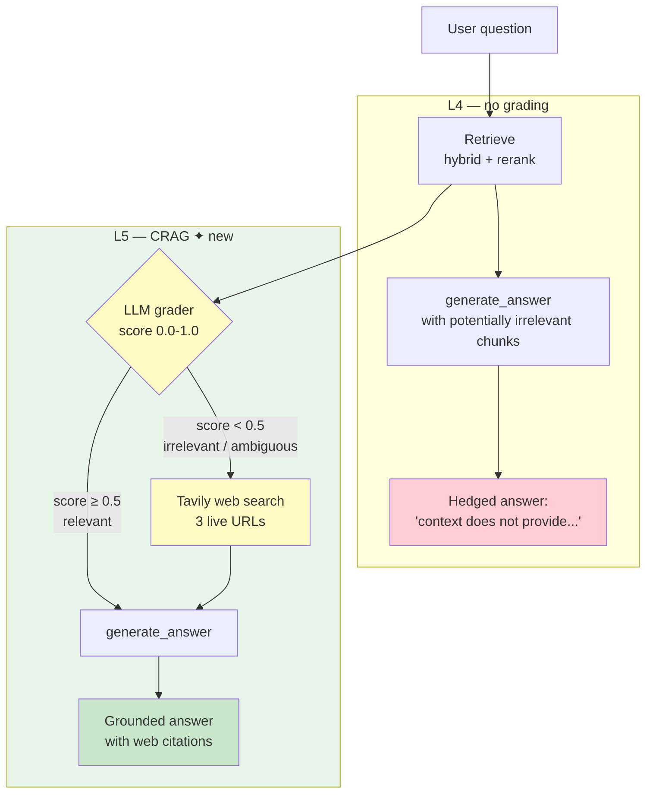

# Lesson 5 — CRAG (Corrective RAG + Tavily Web Fallback)

> **Eval target:** 65% → 78%
> **Branch:** `lesson-5-crag`  ·  **Previous lesson:** `lesson-4-hyde`

## What you'll build

`crag_pipeline()` in `app/services/crag.py`: after hybrid+rerank retrieval, an LLM grader scores the chunks for relevance (0.0–1.0). If the score falls below `0.5` ("ambiguous" or "irrelevant"), CRAG triggers a Tavily web search, replaces the local chunks with live web results, and continues to generation. If chunks are relevant, they pass through unchanged. The system now knows what it doesn't know.

> **Prerequisite:** `TAVILY_API_KEY` must be set in `.env`. This was documented in L0 Setup — if you skipped it, add it now before proceeding.

## Why this feature — the pain from last lesson

After L4, golden questions q-013 and q-014 still fail. `"What is the latest Kubernetes 1.34 release date and what new features did it ship?"` is not in our static corpus of 47 K8s docs — the corpus was frozen at ingestion time. Hybrid+HyDE retrieves chunks about older releases and the LLM either hedges (`"The retrieved context does not provide information..."`) or hallucinates a version from a noise doc. CRAG detects that the relevance score is low and reaches for the open web instead.

## Pipeline diagram (before → after)



## Files you're adding

- `tests/unit/test_crag.py`
- `eval/results/lesson-5-baseline.json`

## Files you're modifying

- `app/services/crag.py` — `grade_chunks()` + `crag_pipeline()` (already present; trace both)
- `app/services/web_search.py` — `search_web()` Tavily wrapper (already present)
- `app/services/rag_service.py` — step 3 in `_retrieve()`: `chunks, _eval, _used_web = crag_pipeline(...)`
- `app/models.py` — `enable_crag: bool = False` (students flip to `True`)

## Step-by-step build

1. **Verify `TAVILY_API_KEY` is set.**
   ```bash
   curl -s http://localhost:8000/admin/health | jq '.tavily'
   # Expected: true
   ```
   If `false`, add `TAVILY_API_KEY=tvly-...` to `.env` and restart: `docker compose restart app`.

2. **Trace `grade_chunks()` in `crag.py`.**
   The function sends retrieved chunk texts to the LLM with the grading prompt and returns a `CRAGEvaluation` with `relevance_score` (0.0–1.0) and `relevance_label` (`irrelevant | ambiguous | somewhat_relevant | highly_relevant`).

3. **Trace `crag_pipeline()` logic.**
   ```python
   evaluation = grade_chunks(question, chunks)
   if not enable_crag:
       return chunks, evaluation, False
   if evaluation.relevance_score < settings.crag_relevance_threshold:   # default 0.5
       web_chunks = search_web(question)
       return web_chunks, evaluation, True
   return chunks, evaluation, False
   ```

4. **Write a unit test for the grader routing decision.**
   Create `tests/unit/test_crag.py`:
   ```python
   from unittest.mock import patch
   from app.models import CRAGEvaluation
   from app.services.crag import crag_pipeline

   def test_crag_triggers_web_fallback_when_irrelevant():
       with patch("app.services.crag.grade_chunks") as mg, \
            patch("app.services.crag.search_web") as mw:
           mg.return_value = CRAGEvaluation(
               relevance_score=0.1, relevance_label="irrelevant",
               confidence=0.9, reasoning="off-topic"
           )
           mw.return_value = []
           _, _, used_web = crag_pipeline("What is quantum entanglement?", [], enable_crag=True)
           assert used_web is True
           mw.assert_called_once()

   def test_crag_skips_web_fallback_when_relevant():
       from app.models import RetrievedChunk
       chunks = [RetrievedChunk(text="Kubernetes Pod docs", source="pods.html", score=0.8)]
       with patch("app.services.crag.grade_chunks") as mg:
           mg.return_value = CRAGEvaluation(
               relevance_score=0.8, relevance_label="highly_relevant",
               confidence=0.9, reasoning="on-topic"
           )
           _, _, used_web = crag_pipeline("What is a Pod?", chunks, enable_crag=True)
           assert used_web is False
   ```
   Run: `uv run pytest tests/unit/test_crag.py -v`

5. **Run eval for CRAG and save the artifact.**
   ```bash
   make eval-crag
   # runs: uv run python -m eval.run_ragas --profile hybrid+rerank+crag --filter crag
   cp eval/results/$(ls -t eval/results/*_hybrid+rerank+crag.json | head -1 | xargs basename) \
      eval/results/lesson-5-baseline.json
   ```

## Verification

### Quick smoke test

```bash
# Without CRAG — hedged answer, no sources
curl -sX POST http://localhost:8000/query \
  -H "Authorization: Bearer $TOKEN" -H "Content-Type: application/json" \
  -d '{"question":"What is the latest Kubernetes 1.34 release date and what new features did it ship?",
       "search_mode":"hybrid","enable_hyde":false,"enable_rerank":true,
       "enable_crag":false,"enable_self_reflective":false,"top_k":5}' \
  | jq '.answer, .sources'
```

Expected: answer contains `"The retrieved context does not provide..."`, sources is `[]` or internal docs.

```bash
# With CRAG — live web answer
curl -sX POST http://localhost:8000/query \
  -H "Authorization: Bearer $TOKEN" -H "Content-Type: application/json" \
  -d '{"question":"What is the latest Kubernetes 1.34 release date and what new features did it ship?",
       "search_mode":"hybrid","enable_hyde":false,"enable_rerank":true,
       "enable_crag":true,"enable_self_reflective":false,"top_k":5}' \
  | jq '.answer, .sources'
```

Expected: answer mentions a real Kubernetes 1.34 release, sources are 3 live URLs (`kubernetes.io/...`, `palark.com/...`, `medium.com/...`). Latency ~17 s.

### Eval check

```bash
make eval-crag
uv run python -m eval.run_ragas --profile hybrid+rerank+crag --filter crag
```

Expected: `faithfulness ~78%` on `crag`-tagged questions (q-013, q-014). Diff:

```bash
uv run python -m eval.diff \
  eval/results/lesson-4-baseline.json \
  eval/results/lesson-5-baseline.json
```

Expected: `faithfulness +13pp` on OOD questions. Latency increase: `+5 s` when web fallback fires.

## What's next

L6 adds Self-RAG. CRAG guards against irrelevant *retrieval*. Self-RAG guards against a shallow *answer* — even when retrieval is good, a vague question like `"how do i scale"` produces a generic answer. Self-RAG scores the answer after generation and retries with a refined question. Eval jumps to ~87%.

## References

- `DEMO_VIDEO_SCRIPT.md` section 6 (CRAG demo, Kubernetes 1.34 query)
- `eval/profiles.py` — `hybrid+rerank+crag` profile
- `app/services/crag.py` — `grade_chunks()`, `crag_pipeline()`
- `app/services/web_search.py` — Tavily wrapper
- Shi et al. (2023) — "CRAG: Corrective Retrieval Augmented Generation"
