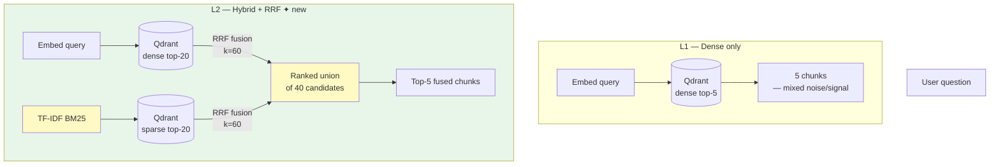

# Lesson 2 — Hybrid Search (Sparse + Dense + RRF)

> **Eval target:** 33% → 45%
> **Branch:** `lesson-2-hybrid`  ·  **Previous lesson:** `lesson-1-naive-rag`

## What you'll build

Parallel dense (OpenAI embeddings via Qdrant) and sparse (TF-IDF BM25 via `sparse_vector_service.py`) retrieval fused with Reciprocal Rank Fusion (RRF). Exact K8s tokens like `ErrImagePull`, `CrashLoopBackOff`, and `kubectl rollout` that dense smears over noisy embeddings will be pinned by BM25. Dense still captures semantic paraphrases like "how do I roll back?". RRF keeps the best of both without manual score calibration.

## Why this feature — the pain from last lesson

After L1, questions with literal K8s error tokens fail because dense embeddings blend `ErrImagePull` with loosely-related image/pull/registry content from academic noise docs. Golden question q-007 (`"What does error ErrImagePull mean and how do I fix it?"`) fails with `expected_baseline: fail`. BM25 would pin `troubleshooting-pods.html` immediately — but BM25 alone loses the semantic fallback for paraphrase queries. Hybrid with RRF gives both.

## Pipeline diagram (before → after)



## Files you're adding

- `tests/unit/test_hybrid_search.py`
- `eval/results/lesson-2-baseline.json`

## Files you're modifying

- `app/services/vector_store.py` — `hybrid_search()` function (already present; verify RRF logic)
- `app/services/sparse_vector_service.py` — TF-IDF sparse encoder (already present; verify `encode()`)
- `app/services/rag_service.py` — `_retrieve()` hybrid branch (already present; trace the code path)
- `app/models.py` — `search_mode: str = "dense"` is already there; students set it to `"hybrid"`

## Step-by-step build

1. **Inspect `sparse_vector_service.py`.**
   Confirm `SparseVectorService.encode(text: str) -> dict[int, float]` returns a token-index → weight mapping compatible with Qdrant's sparse vector format.

2. **Inspect `hybrid_search()` in `vector_store.py`.**
   The function should:
   - Query Qdrant with the dense embedding (top-20 candidates).
   - Query Qdrant with the sparse vector (top-20 candidates).
   - Merge using RRF: `score(doc) = Σ 1 / (k + rank_in_list)` for each list.
   - Return top-`top_k` by fused score.

3. **Trace the hybrid branch in `_retrieve()`.**
   In `app/services/rag_service.py`:
   ```python
   elif search_mode == "hybrid":
       embeddings = embed_texts([question])
       query_embedding = embeddings[0]
       chunks = hybrid_search(
           query_embedding=query_embedding,
           query_text=question,
           top_k=top_k,
           rrf_k=settings.rrf_k,
       )
   ```
   The `rrf_k` setting (default `60`) is in `app/config.py`.

4. **Write a unit test confirming both retrievers are called.**
   Create `tests/unit/test_hybrid_search.py`:
   ```python
   from unittest.mock import patch
   from app.services.rag_service import _retrieve

   def test_hybrid_calls_both_retrievers():
       with patch("app.services.rag_service.embed_texts") as me, \
            patch("app.services.rag_service.hybrid_search") as mh:
           me.return_value = [[0.0] * 1536]
           mh.return_value = []
           _retrieve("Show nodeSelector in a Pod spec", {
               "search_mode": "hybrid", "top_k": 5,
               "enable_rerank": False, "enable_crag": False, "enable_hyde": False
           })
           mh.assert_called_once()
   ```
   Run: `uv run pytest tests/unit/test_hybrid_search.py -v`

5. **Run the hybrid eval and save the artifact.**
   ```bash
   make eval-hybrid
   cp eval/results/$(ls -t eval/results/*_hybrid.json | head -1 | xargs basename) \
      eval/results/lesson-2-baseline.json
   ```

## Verification

### Quick smoke test

Run the same query in three modes and compare the `sources` field:

```bash
for MODE in dense sparse hybrid; do
  echo "=== $MODE ==="; \
  curl -sX POST http://localhost:8000/query \
    -H "Authorization: Bearer $TOKEN" \
    -H "Content-Type: application/json" \
    -d "{\"question\":\"Show me a Pod manifest with nodeSelector and explain when to use it\",
         \"search_mode\":\"$MODE\",\"enable_rerank\":false,\"enable_crag\":false,
         \"enable_hyde\":false,\"enable_self_reflective\":false,\"top_k\":5}" \
    | jq '.sources'; done
```

Expected:
- `dense` — `daemonset.html`, `pod-v1.docx` (conceptual, misses cheatsheet)
- `sparse` — `pod-v1.docx`, `cheatsheet.txt` (literal YAML, misses conceptual)
- `hybrid` — `pod-v1.docx`, `daemonset.html`, `cheatsheet.txt` (both signals)

### Eval check

```bash
make eval-hybrid
uv run python -m eval.run_ragas --profile hybrid
```

Expected: `context_recall ~45%` (up from 33% in L1). Open `eval/results/lesson-2-baseline.json` and compare to `eval/results/lesson-1-baseline.json`.

```bash
uv run python -m eval.diff \
  eval/results/lesson-1-baseline.json \
  eval/results/lesson-2-baseline.json
```

Expected diff: `context_recall +12pp`, `answer_relevancy +3pp`.

## What's next

L3 adds a cross-encoder reranker on top of the hybrid top-20 candidate pool. The reranker re-reads each (query, chunk) pair holistically and re-scores — noise chunks that BM25 or dense incorrectly boosted will drop, and the precision of the top-5 delivered to the LLM will improve. Eval jumps to ~55%.

## References

- `DEMO_VIDEO_SCRIPT.md` section 3 (Hybrid search demo, `nodeSelector` query)
- `eval/profiles.py` — `hybrid` profile
- `app/services/vector_store.py` — `hybrid_search()`
- `app/services/sparse_vector_service.py` — TF-IDF BM25 encoder
- Robertson & Zaragoza (2009) — "The Probabilistic Relevance Framework: BM25 and Beyond"
