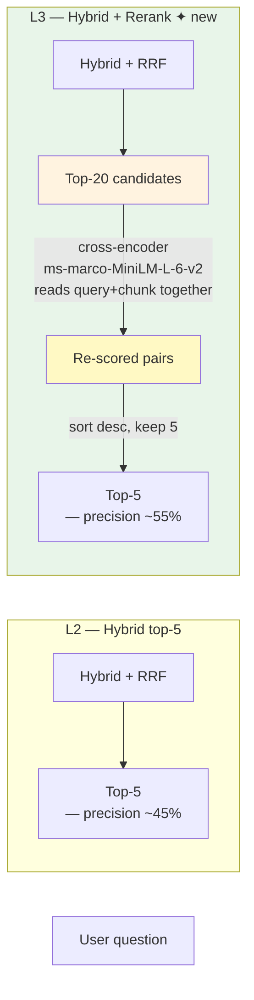

# Lesson 3 — Reranking (Cross-Encoder)

> **Eval target:** 45% → 55%
> **Branch:** `lesson-3-reranking`  ·  **Previous lesson:** `lesson-2-hybrid`

## What you'll build

A cross-encoder reranker (`ms-marco-MiniLM-L-6-v2` via `sentence-transformers`) that receives the hybrid top-20 candidate chunks and re-scores every (query, chunk) pair by reading them together — not independently. The top-5 surviving chunks are far more likely to contain the precise answer. Optionally, a Voyage AI backend can be swapped in for production.

## Why this feature — the pain from last lesson

After L2, hybrid retrieval surfaces the right documents, but precision in the top-5 is still shaky. Golden question q-009 (`"How long does a rolling update take in Kubernetes?"`) fails because noise docs containing "update" and "time" still land in the hybrid top-5 ahead of the `deployments.html` chunk that actually defines `maxSurge` and `maxUnavailable`. The bi-encoder (used in both dense and sparse retrieval) scores chunks independently; it cannot see whether the chunk actually *answers* the query. The cross-encoder does.

## Pipeline diagram (before → after)



## Files you're adding

- `tests/unit/test_reranking.py`
- `eval/results/lesson-3-baseline.json`

## Files you're modifying

- `app/services/reranking.py` — `Reranker.rerank()` (already present; trace `_rerank_local()`)
- `app/services/rag_service.py` — step 2 in `_retrieve()`: `if enable_rerank and chunks: chunks = Reranker().rerank(...)`
- `app/models.py` — `enable_rerank: bool = False` (students flip to `True`)

## Step-by-step build

1. **Inspect `Reranker._rerank_local()` in `reranking.py`.**
   Confirm the local backend loads `CrossEncoder(settings.reranker_model)` (default: `ms-marco-MiniLM-L-6-v2`) and calls `model.predict([(query, chunk.text) for chunk in chunks])` to get relevance scores.

2. **Understand the retrieve → rerank ordering.**
   In `app/services/rag_service.py`, the pipeline is:
   ```python
   # 1. Retrieve (hybrid top-20)
   chunks = hybrid_search(..., top_k=top_k * 4)   # fetch larger pool
   # 2. Rerank
   if enable_rerank and chunks:
       chunks = Reranker().rerank(question, chunks, top_k=top_k)
   ```
   The reranker reduces 20 candidates to `top_k=5`, not the other way around.

3. **Add `enable_rerank` flag to a test request.**
   In `app/models.py`, `enable_rerank: bool = False` should already exist. Verify it.

4. **Write a unit test for the reranker.**
   Create `tests/unit/test_reranking.py`:
   ```python
   from unittest.mock import patch, MagicMock
   from app.services.reranking import Reranker
   from app.models import RetrievedChunk

   def test_reranker_returns_top_k():
       chunks = [RetrievedChunk(text=f"chunk {i}", source=f"doc{i}.html", score=float(i))
                 for i in range(10)]
       with patch("app.services.reranking.settings") as ms:
           ms.reranker_backend = "local"
           ms.reranker_model = "cross-encoder/ms-marco-MiniLM-L-6-v2"
           ms.reranker_initial_top_k = 5
           r = Reranker()
           with patch.object(r, "_rerank_local") as mock_local:
               mock_local.return_value = chunks[:5]
               result = r.rerank("test query", chunks, top_k=5)
               assert len(result) == 5
   ```
   Run: `uv run pytest tests/unit/test_reranking.py -v`

5. **Run eval with reranking and save the artifact.**
   ```bash
   make eval-rerank
   cp eval/results/$(ls -t eval/results/*_hybrid+rerank.json | head -1 | xargs basename) \
      eval/results/lesson-3-baseline.json
   ```

## Verification

### Quick smoke test

```bash
curl -sX POST http://localhost:8000/query \
  -H "Authorization: Bearer $TOKEN" \
  -H "Content-Type: application/json" \
  -d '{
    "question": "What is the best practice for managing application secrets securely?",
    "search_mode": "hybrid",
    "enable_hyde": false,
    "enable_rerank": true,
    "enable_crag": false,
    "enable_self_reflective": false,
    "top_k": 5
  }' | jq '.sources[0], .chunks[0].score'
```

Expected:
- Source: `secret.txt`
- Score (with rerank ON): `~3.315` — roughly 100× higher than without reranking (`~0.033`)

Compare side-by-side to confirm the boost:

```bash
# Without reranking
curl -sX POST http://localhost:8000/query \
  -H "Authorization: Bearer $TOKEN" \
  -H "Content-Type: application/json" \
  -d '{"question":"What is the best practice for managing application secrets securely?","search_mode":"hybrid","enable_rerank":false,"top_k":5}' \
  | jq '.chunks[0].score'
# Expected: ~0.033

# With reranking
curl -sX POST http://localhost:8000/query \
  -H "Authorization: Bearer $TOKEN" \
  -H "Content-Type: application/json" \
  -d '{"question":"What is the best practice for managing application secrets securely?","search_mode":"hybrid","enable_rerank":true,"top_k":5}' \
  | jq '.chunks[0].score'
# Expected: ~3.315
```

### Eval check

```bash
make eval-rerank
uv run python -m eval.run_ragas --profile hybrid+rerank
```

Expected: `context_precision ~55%` (up from 45% in L2). Open `eval/results/lesson-3-baseline.json` and diff:

```bash
uv run python -m eval.diff \
  eval/results/lesson-2-baseline.json \
  eval/results/lesson-3-baseline.json
```

Expected: `context_precision +10pp`, `faithfulness slight lift`.

## What's next

L4 adds HyDE (Hypothetical Document Embeddings). Even with hybrid + reranking, queries like "Is there a way to isolate network traffic between services?" still fail because the user's vocabulary (`isolate traffic`) doesn't appear in the corpus — `NetworkPolicy` does. HyDE generates a hypothetical answer first, embeds *that*, and retrieves by the richer vocabulary. Eval jumps to ~65%.

## References

- `DEMO_VIDEO_SCRIPT.md` section 4 (Reranking demo, secrets query)
- `eval/profiles.py` — `hybrid+rerank` profile
- `app/services/reranking.py` — `Reranker` class
- Nogueira & Cho (2019) — "Passage Re-ranking with BERT"
