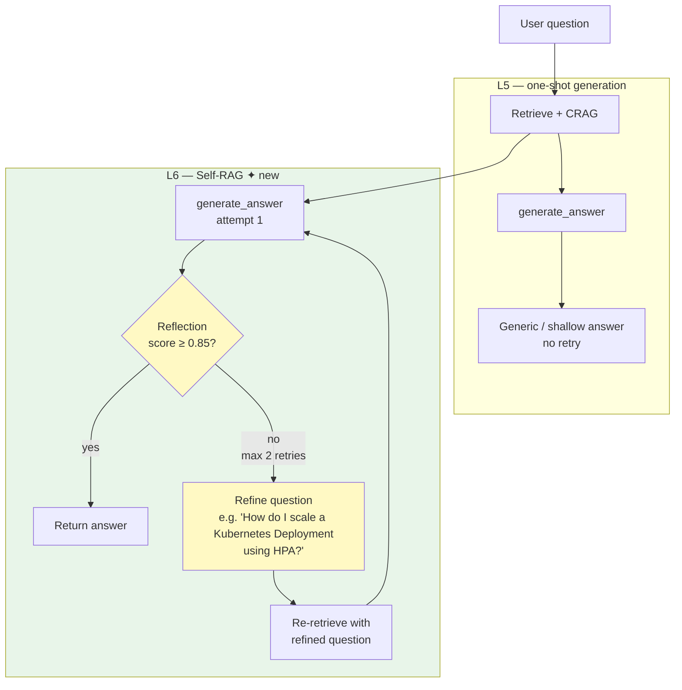

# Lesson 6 — Self-RAG (Reflect-Refine Cycle)

> **Eval target:** 78% → 87%
> **Branch:** `lesson-6-self-rag`  ·  **Previous lesson:** `lesson-5-crag`

## What you'll build

A post-generation reflection loop in `app/services/self_reflective.py`: after the LLM produces an answer, a strict LLM reviewer scores it on relevance, accuracy, completeness, and clarity (each 1–10). If the overall reflection score is below `0.85` — or the answer hedges/refuses — `should_regenerate()` returns `True`, and the system replaces the original question with a sharper `refined_question` and re-retrieves. Bounded to 2 retries. The refinement and iteration count surface in response metadata as `refined_question` and `reflection_iterations`.

## Why this feature — the pain from last lesson

After L5, retrieval is accurate and CRAG handles out-of-distribution gaps. But vague queries like `"how do i scale"` (golden q-015, q-016) still produce shallow answers — the retriever gets lucky and finds *some* pods/deployment docs, but the LLM produces a generic one-liner because the question is underspecified. CRAG only checks retrieval quality; it cannot detect a generated answer that hedges or misses depth. Self-RAG catches that by reflecting on the output.

## Pipeline diagram (before → after)



## Files you're adding

- `tests/unit/test_self_reflective.py`
- `eval/results/lesson-6-baseline.json`

## Files you're modifying

- `app/services/self_reflective.py` — `reflect_on_answer()`, `should_regenerate()` (already present; trace both)
- `app/services/rag_service.py` — the `_generate()` function wraps generation in the Self-RAG loop
- `app/models.py` — `enable_self_reflective: bool = False` (students flip to `True`)

## Step-by-step build

1. **Inspect `reflect_on_answer()` in `self_reflective.py`.**
   The function sends the question, answer, and retrieved context to `gpt-4o-mini` (the grader model) with a strict rubric. Key fields in the returned `ReflectionResult`:
   - `reflection_score: float` (0.0–1.0)
   - `needs_regeneration: bool` (true if score < 0.85 or any criterion ≤ 5)
   - `refined_question: str` (the sharper reformulation when regeneration is needed)

2. **Inspect `should_regenerate()` logic.**
   ```python
   def should_regenerate(result: ReflectionResult, iteration: int, max_iterations: int = 2) -> bool:
       return result.needs_regeneration and iteration < max_iterations
   ```

3. **Trace the reflection loop in `_generate()` in `rag_service.py`.**
   The existing implementation wraps generation in a loop:
   ```python
   for iteration in range(settings.self_rag_max_iterations + 1):
       response = _generate_once(question, chunks, flags)
       if not enable_self_reflective:
           break
       reflection = reflect_on_answer(question, response.answer, context=spotlighted)
       if not should_regenerate(reflection, iteration):
           break
       question = reflection.refined_question   # re-retrieve with better question
       chunks = _retrieve(question, flags)
   response.metadata["reflection_iterations"] = iteration
   response.metadata["refined_question"] = reflection.refined_question if iteration > 0 else None
   ```

4. **Write a unit test for the reflection loop.**
   Create `tests/unit/test_self_reflective.py`:
   ```python
   from unittest.mock import patch
   from app.models import ReflectionResult
   from app.services.self_reflective import should_regenerate, reflect_on_answer

   def test_should_regenerate_respects_max_iterations():
       result = ReflectionResult(reflection_score=0.5, needs_regeneration=True,
                                  refined_question="better q", reasoning="too vague")
       assert should_regenerate(result, iteration=0, max_iterations=2) is True
       assert should_regenerate(result, iteration=2, max_iterations=2) is False

   def test_no_regeneration_when_score_high():
       result = ReflectionResult(reflection_score=0.92, needs_regeneration=False,
                                  refined_question="", reasoning="good answer")
       assert should_regenerate(result, iteration=0) is False
   ```
   Run: `uv run pytest tests/unit/test_self_reflective.py -v`

5. **Manually test with the vague query.**
   In Streamlit (`make streamlit`), enable Self-Reflective toggle and run `"how do i scale"`. Watch the metadata panel for `reflection_iterations: 2` and `refined_question`.

6. **Run the full eval and save the artifact.**
   ```bash
   make eval-all
   cp eval/results/$(ls -t eval/results/*_all.json | head -1 | xargs basename) \
      eval/results/lesson-6-baseline.json
   ```

## Verification

### Quick smoke test

```bash
# Without Self-RAG
curl -sX POST http://localhost:8000/query \
  -H "Authorization: Bearer $TOKEN" -H "Content-Type: application/json" \
  -d '{"question":"how do i scale","search_mode":"hybrid","enable_rerank":true,
       "enable_self_reflective":false,"top_k":5}' \
  | jq '.answer, .metadata.reflection_iterations, .metadata.refined_question'
```

Expected: generic `kubectl scale ...` answer. `reflection_iterations: 0`, `refined_question: null`.

```bash
# With Self-RAG
curl -sX POST http://localhost:8000/query \
  -H "Authorization: Bearer $TOKEN" -H "Content-Type: application/json" \
  -d '{"question":"how do i scale","search_mode":"hybrid","enable_rerank":true,
       "enable_self_reflective":true,"top_k":5}' \
  | jq '.answer, .metadata.reflection_iterations, .metadata.refined_question'
```

Expected: richer answer covering HPA, manual `kubectl scale`, and `replicas`. `reflection_iterations: 2`. `refined_question` shows the system's internally generated better question (e.g., `"How do I scale a Kubernetes Deployment using HPA?"`).

### Eval check

```bash
make eval-all
uv run python -m eval.run_ragas --profile all
```

Expected: `answer_relevancy ~87%` across all questions. Diff vs L5:

```bash
uv run python -m eval.diff \
  eval/results/lesson-5-baseline.json \
  eval/results/lesson-6-baseline.json
```

Expected: `answer_relevancy +9pp` on vague/underspecified golden questions (q-015, q-016). Latency increase on vague queries: `+8–10 s` (2 extra reflection + retrieval calls).

## What's next

L7 adds the Text2SQL router. Even with all retrieval features on, questions like `"How many P1 incidents occurred in production clusters in the last 30 days?"` cannot be answered from documents — the answer lives in the K8s ops database. L7 adds an LLM-based intent classifier that routes such questions to Vanna AI for SQL generation, human approval, and execution. Eval jumps to ~95%.

## References

- `DEMO_VIDEO_SCRIPT.md` section 7 (Self-RAG demo, `"how do i scale"` query)
- `eval/profiles.py` — `all` profile
- `app/services/self_reflective.py` — `reflect_on_answer()`, `should_regenerate()`
- Asai et al. (2023) — "Self-RAG: Learning to Retrieve, Generate, and Critique through Self-Reflection"
