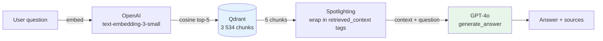

# Lesson 1 — Naive RAG (Dense Top-k=5)

> **Eval target:** 33% → 33% (locks the baseline — no improvement expected)
> **Branch:** `lesson-1-naive-rag`  ·  **Previous lesson:** `lesson-0-setup`

## What you'll build

The minimal working RAG pipeline: embed the user query with OpenAI `text-embedding-3-small`, retrieve the top-5 most similar chunks from Qdrant by cosine similarity, spotlight the chunks inside `<retrieved_context>` tags, and call GPT-4o to generate a grounded answer. Every subsequent lesson improves on this exact pipeline.

## Why this feature — the pain from last lesson

After L0, infrastructure is up and the corpus is loaded, but the app returns stub answers. Today most production RAG systems start naive — let's see how far that gets us. The 30% noise in our corpus (30 academic CS papers alongside 47 K8s docs) ensures that dense-only retrieval will visibly fail on a meaningful fraction of the golden questions. The eval run at the end of this lesson locks that 33% number so future improvements are unambiguous.

## Pipeline diagram (before → after)



## Files you're adding

- `tests/unit/test_rag_service.py` — smoke tests for `_retrieve` and `_generate`
- `eval/results/lesson-1-baseline.json` — copy of the naive eval run

## Files you're modifying

- `app/services/rag_service.py` — `_retrieve()` and `_generate()` are already implemented; verify the dense path
- `app/core/graph.py` — `retrieve_rag` node calls `_retrieve`; `generate_answer` calls `_generate`
- `app/models.py` — confirm `QueryRequest` has `search_mode`, `enable_hyde`, `enable_rerank`, `enable_crag`, `enable_self_reflective`, `top_k`

## Step-by-step build

1. **Inspect the dense retrieval path in `rag_service.py`.**
   Open `app/services/rag_service.py` and find `_retrieve()`. Confirm the `else` (dense) branch:
   ```python
   embeddings = embed_texts([question])
   query_embedding = embeddings[0]
   chunks = search(query_embedding, top_k=top_k)
   ```
   This is all naive RAG does. No reranking, no HyDE, no CRAG guard.

2. **Confirm the graph wires `retrieve_rag → generate_answer`.**
   In `app/core/graph.py`, the `retrieve_rag` node should call `_retrieve(state["question"], flags)` and write results to `state["chunks"]`.

3. **Verify `QueryRequest` in `app/models.py`.**
   All flag fields must be present with defaults:
   ```python
   search_mode: str = "dense"
   enable_hyde: bool = False
   enable_rerank: bool = False
   enable_crag: bool = False
   enable_self_reflective: bool = False
   top_k: int = 5
   ```

4. **Write a minimal unit test.**
   Create `tests/unit/test_rag_service.py`:
   ```python
   from unittest.mock import patch, MagicMock
   from app.services.rag_service import _retrieve

   def test_dense_retrieve_calls_embed_and_search():
       with patch("app.services.rag_service.embed_texts") as mock_embed, \
            patch("app.services.rag_service.search") as mock_search:
           mock_embed.return_value = [[0.1] * 1536]
           mock_search.return_value = []
           result = _retrieve("What is a Pod?", {"search_mode": "dense", "top_k": 5,
                                                  "enable_rerank": False, "enable_crag": False})
           mock_embed.assert_called_once()
           mock_search.assert_called_once()
   ```
   Run: `uv run pytest tests/unit/test_rag_service.py -v` — should pass.

5. **Run the full naive eval.**
   ```bash
   make eval-baseline
   cp eval/results/$(ls -t eval/results/*_naive.json | head -1 | xargs basename) \
      eval/results/lesson-1-baseline.json
   ```

## Verification

### Quick smoke test

```bash
# Ensure TOKEN is set from L0
curl -sX POST http://localhost:8000/query \
  -H "Authorization: Bearer $TOKEN" \
  -H "Content-Type: application/json" \
  -d '{
    "question": "How do containers share resources within a Pod?",
    "search_mode": "dense",
    "enable_hyde": false,
    "enable_rerank": false,
    "enable_crag": false,
    "enable_self_reflective": false,
    "top_k": 5
  }' | jq '.answer, .sources[0], .metadata.latency_ms'
```

Expected: answer describes shared network namespace, IP, volumes, localhost. Source includes `pods.html`. Latency ~6 000 ms.

Now try a question where naive RAG fails — watch the chunks panel:

```bash
curl -sX POST http://localhost:8000/query \
  -H "Authorization: Bearer $TOKEN" \
  -H "Content-Type: application/json" \
  -d '{
    "question": "What does error ErrImagePull mean and how do I fix it?",
    "search_mode": "dense",
    "enable_hyde": false, "enable_rerank": false,
    "enable_crag": false, "enable_self_reflective": false,
    "top_k": 5
  }' | jq '.sources'
```

Expected: sources are NOT `troubleshooting-pods.html` — the noise corpus is drowning the signal. This motivates L2.

### Eval check

```bash
make eval-baseline
uv run python -m eval.run_ragas --profile naive
```

Expected: `context_recall ~33%`. Compare against `eval/results/lesson-0-baseline.json` — numbers should match. If they diverge, your environment changed between lessons; re-seed with `make seed-data`.

## What's next

L2 adds hybrid search (BM25 sparse + dense + Reciprocal Rank Fusion). The literal token `ErrImagePull` that dense just missed will be exactly what BM25 pins. Eval jumps to ~45%.

## References

- `DEMO_VIDEO_SCRIPT.md` section 1 (Dense search demo)
- `eval/profiles.py` — `naive` profile
- `app/services/rag_service.py` — `_retrieve()`, `_generate()`
- `app/security/spotlighting.py` — `build_spotlighted_context()`
