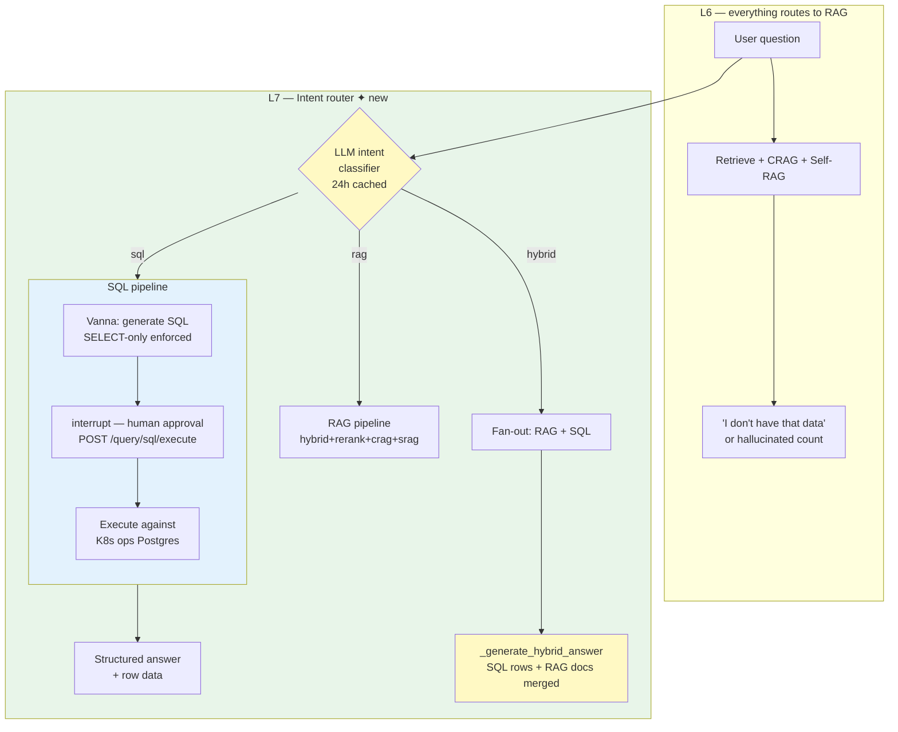

# Lesson 7 — Text2SQL Routing (LLM Intent Router + Vanna AI)

> **Eval target:** 87% → 95%
> **Branch:** `lesson-7-text2sql`  ·  **Previous lesson:** `lesson-6-self-rag`

## What you'll build

An LLM-based intent router (`classify_intent()` in `app/services/router_service.py`) that classifies every question as `sql`, `rag`, or `hybrid`. SQL questions flow through `app/services/sql_service.py` (Vanna AI + schema introspection), pause at a `interrupt()` checkpoint for human SQL approval, then execute `SELECT`-only against the K8s ops Postgres database. The result is returned as structured data alongside a natural-language answer. Hybrid fan-out queries get both SQL rows and RAG chunks merged in a single response.

## Why this feature — the pain from last lesson

After L6, all RAG features are on. Golden questions q-017 and q-018 (`"How many P1 incidents were resolved in the last quarter?"`, `"Which cluster currently has the most pods in CrashLoopBackOff status?"`) still fail — they require `COUNT`, `JOIN`, and `WHERE` against the K8s ops database. These answers are not in any document; they live in 50K rows of operational data. RAG cannot answer them.

## Pipeline diagram (before → after)



## Files you're adding

- `tests/unit/test_router_service.py`
- `eval/results/lesson-7-baseline.json`

## Files you're modifying

- `app/services/router_service.py` — `classify_intent()` (already present; trace the LLM call and 24h cache)
- `app/services/sql_service.py` — Vanna integration + `generate_sql()` + `execute_sql()` (already present)
- `app/core/graph.py` — `route_intent`, `generate_sql_node`, `execute_sql`, `request_sql_approval` nodes (already present)
- `app/api/query.py` — `POST /query/sql/execute` endpoint (already present)

## Step-by-step build

1. **Trace `classify_intent()` in `router_service.py`.**
   The function sends the question to GPT-4o with a K8s-domain system prompt enumerating the SQL schema tables (`clusters`, `nodes`, `pods`, `deployments`, `incidents`, `alerts`, `oncall_logs`) and returns `"sql"`, `"rag"`, or `"hybrid"`. Result is Redis-cached for 24 h.

2. **Trace the SQL subgraph in `graph.py`.**
   Key nodes: `route_intent → generate_sql_node → request_sql_approval` (interrupt) → `execute_sql → finalize`.
   The `interrupt()` call pauses the LangGraph checkpointer at SQL approval, returning `route: "sql"` and `pending_sql` to the caller.

3. **Inspect `generate_sql()` in `sql_service.py`.**
   Vanna introspects `information_schema` at startup to build a schema string. Only `SELECT` statements pass the safety check; `INSERT`, `UPDATE`, `DELETE`, `DROP` raise `ValueError`.

4. **Write a unit test for intent routing.**
   Create `tests/unit/test_router_service.py`:
   ```python
   from unittest.mock import patch
   from app.services.router_service import classify_intent

   def test_sql_intent_for_count_question():
       with patch("app.services.router_service.generate_with_json") as mg, \
            patch("app.services.router_service.query_cache") as mc:
           mc.get_intent.return_value = None
           mg.return_value = {"text": '{"intent": "sql"}', "model": "gpt-4o"}
           result = classify_intent("How many P1 incidents last month?")
           assert result == "sql"

   def test_rag_intent_for_concept_question():
       with patch("app.services.router_service.generate_with_json") as mg, \
            patch("app.services.router_service.query_cache") as mc:
           mc.get_intent.return_value = None
           mg.return_value = {"text": '{"intent": "rag"}', "model": "gpt-4o"}
           result = classify_intent("What is a Kubernetes Deployment?")
           assert result == "rag"
   ```
   Run: `uv run pytest tests/unit/test_router_service.py -v`

5. **Run the two-step SQL demo end-to-end.**

   Step A — generate SQL:
   ```bash
   RESPONSE=$(curl -sX POST http://localhost:8000/query \
     -H "Authorization: Bearer $TOKEN" -H "Content-Type: application/json" \
     -d '{"question":"How many P1 incidents occurred in production clusters in the last 30 days?",
          "search_mode":"hybrid","enable_rerank":true}')
   echo $RESPONSE | jq '.route, .pending_sql'
   QUERY_ID=$(echo $RESPONSE | jq -r '.query_id')
   ```

   Step B — approve and execute:
   ```bash
   curl -sX POST http://localhost:8000/query/sql/execute \
     -H "Authorization: Bearer $TOKEN" -H "Content-Type: application/json" \
     -d "{\"query_id\":\"$QUERY_ID\",\"approved\":true}" | jq '.answer'
   ```

6. **Run the eval and save the artifact.**
   ```bash
   uv run python -m eval.run_ragas --profile all
   cp eval/results/$(ls -t eval/results/*_all.json | head -1 | xargs basename) \
      eval/results/lesson-7-baseline.json
   ```

## Verification

### Quick smoke test — SQL route

```bash
curl -sX POST http://localhost:8000/query \
  -H "Authorization: Bearer $TOKEN" -H "Content-Type: application/json" \
  -d '{
    "question": "How many P1 incidents occurred in production clusters in the last 30 days?",
    "search_mode": "hybrid",
    "enable_rerank": true,
    "enable_hyde": false,
    "enable_crag": false,
    "enable_self_reflective": false,
    "top_k": 5
  }' | jq '.route, .pending_sql'
```

Expected: `"route": "sql"`. `pending_sql` contains a valid `SELECT COUNT(*) ... FROM incidents JOIN clusters ...` statement.

### Contrast — RAG route

```bash
curl -sX POST http://localhost:8000/query \
  -H "Authorization: Bearer $TOKEN" -H "Content-Type: application/json" \
  -d '{"question":"What is the Kubernetes incident response best practice?",
       "search_mode":"hybrid","enable_rerank":true}' \
  | jq '.route'
```

Expected: `"route": "rag"`. Proves the router is domain-aware, not just matching keywords.

### Eval check

```bash
uv run python -m eval.run_ragas --profile all
```

Expected: `context_recall ~95%` across all 21 golden questions. Diff vs L6:

```bash
uv run python -m eval.diff \
  eval/results/lesson-6-baseline.json \
  eval/results/lesson-7-baseline.json
```

Expected: `answer_relevancy +8pp` driven by SQL questions (q-017, q-018) now answering correctly.

## What's next

L8 adds the five-tier caching layer. The eval score does not change (all questions still answered correctly), but repeated queries become drastically cheaper and faster: same question twice costs ~2.7× less time and zero additional OpenAI tokens on the second call.

## References

- `DEMO_VIDEO_SCRIPT.md` section 8 (Text2SQL demo, P1 incidents query + two-step flow)
- `eval/profiles.py` — `all` profile
- `app/services/router_service.py` — `classify_intent()`
- `app/services/sql_service.py` — Vanna + `generate_sql()`, `execute_sql()`
- `app/core/graph.py` — `request_sql_approval` interrupt node
