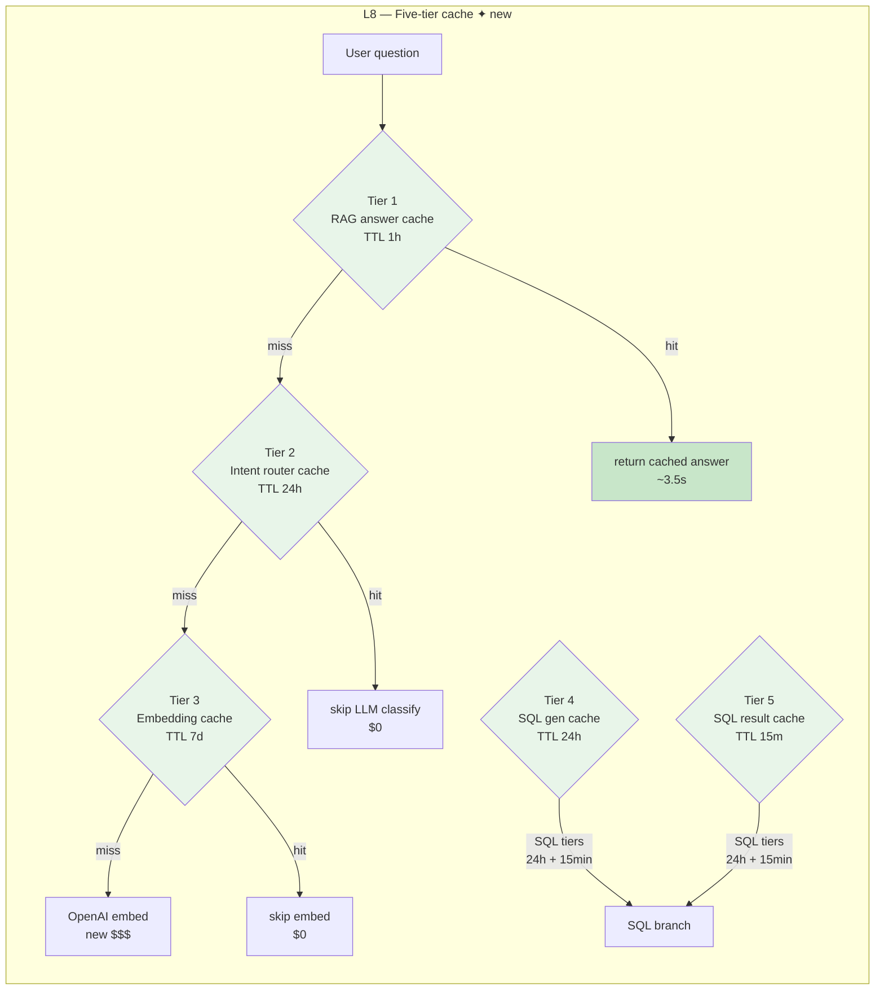

# Lesson 8 — Five-Tier Caching

> **Eval target:** no eval change — manual Streamlit demo
> **Branch:** `lesson-8-caching`  ·  **Previous lesson:** `lesson-7-text2sql`

## What you'll build

A five-tier cache architecture in `app/services/query_cache_service.py`, backed by Upstash Redis with an in-memory fallback. Each pipeline stage has its own TTL-keyed cache tier: embeddings (7 days), intent routing (24 h), SQL generation (24 h), SQL result (15 min), and RAG answers (1 h). Every response carries `cache_hit: bool` and `cost_saved` metadata. The `/admin/cache/stats` endpoint exposes per-tier hit/miss rates.

## Why this feature — the pain from last lesson

After L7, every query pays full OpenAI token cost even when the user asks the same question again. In production, an SRE assistant running 500 queries/day on a 5-person team will repeat many of the same questions. Without caching, you pay for every single embedding call, every intent classification, every SQL generation, and every full RAG generation — repeatedly. With caching, a warm repeat query takes ~3.5 s instead of ~9 s and costs $0 additional tokens.

## Pipeline diagram (before → after)



## Files you're adding

- `tests/unit/test_query_cache.py`

## Files you're modifying

- `app/services/query_cache_service.py` — `QueryCacheService` class (already present; trace the tier keys and TTLs)
- `app/services/rag_service.py` — `run_rag_with_trace()` wraps `_retrieve()` + `_generate()` in cache lookup/store
- `app/services/embedding_service.py` — caches individual embedding vectors by text hash
- `app/services/router_service.py` — caches intent classification by question text
- `app/services/sql_service.py` — caches generated SQL and SQL results separately

## Step-by-step build

1. **Trace the five tiers in `query_cache_service.py`.**
   Each tier has a dedicated key method:
   ```python
   cache.intent_key(question)       # sha256(question.lower())
   cache.rag_answer_key(question)   # sha256(question + flags)
   cache.sql_gen_key(question)      # sha256(question)
   cache.sql_result_key(sql)        # sha256(normalized SQL) + ":v2"
   # embedding keys are managed in embedding_service.py directly
   ```
   TTLs are set at `_set()` call sites. Verify them in the source.

2. **Inspect Redis vs in-memory fallback.**
   `QueryCacheService.__init__()` tries to connect to Upstash Redis using `settings.upstash_redis_url` and `settings.upstash_redis_token`. If either is missing or the connection fails, it falls back to an in-process `dict` with expiry checks. The fallback is not shared across uvicorn workers.

3. **Inspect `run_rag_with_trace()` cache guard.**
   The RAG answer cache checks `cache.get_rag_answer(question, cache_context)` before any retrieval. On a hit, it deserializes the cached `ChatResponse` and sets `cache_hit: True` in the metadata.

4. **Write a unit test for the cache key contract.**
   Create `tests/unit/test_query_cache.py`:
   ```python
   from app.services.query_cache_service import QueryCacheService

   def test_same_question_same_key():
       svc = QueryCacheService()
       k1 = svc.rag_answer_key("What is a Pod?")
       k2 = svc.rag_answer_key("What is a Pod?")
       assert k1 == k2

   def test_different_questions_different_keys():
       svc = QueryCacheService()
       k1 = svc.rag_answer_key("What is a Pod?")
       k2 = svc.rag_answer_key("What is a Service?")
       assert k1 != k2
   ```
   Run: `uv run pytest tests/unit/test_query_cache.py -v`

5. **Verify UPSTASH_REDIS_URL and UPSTASH_REDIS_TOKEN are set.**
   ```bash
   curl -s http://localhost:8000/admin/health | jq '.redis'
   # Expected: true
   ```
   If `false`, add credentials to `.env` and restart the app container.

## Verification

### Streamlit walkthrough

```bash
make streamlit
```

Open `http://localhost:8501`.

**Part A — Query speedup (cold vs warm):**

1. In the Streamlit query box, type exactly:
   ```
   What is a Pod in Kubernetes?
   ```
   Set all toggles OFF, `search_mode=dense`, then submit. Note the latency badge: expected ~9 s. Note `cache_hit: false`.

2. Submit the **identical** query again without changing any setting. Note the latency badge: expected ~3.5 s. Note `cache_hit: true`.

3. Change only `top_k` from 5 to 3 and submit. Note: `cache_hit: false` — the cache key includes all flags, so any change produces a miss.

**Part B — Admin cache stats:**

Get an admin token, then check stats:

```bash
ADMIN_TOKEN=$(curl -sX POST http://localhost:8000/auth/login \
  -H "Content-Type: application/json" \
  -d '{"username":"admin@demo.local","password":"admin123"}' | jq -r .token)

curl -s http://localhost:8000/admin/cache/stats \
  -H "Authorization: Bearer $ADMIN_TOKEN" | jq
```

Expected output (typical after a few demo queries):

```json
{
  "embedding":     {"hits": 16, "misses": 15, "hit_rate": 0.52},
  "intent_router": {"hits": 19, "misses": 13, "hit_rate": 0.59},
  "sql_gen":       {"hits":  1, "misses":  1, "hit_rate": 0.50},
  "sql_result":    {"hits":  0, "misses":  1, "hit_rate": 0.00},
  "rag":           {"hits":  1, "misses":  1, "hit_rate": 0.50}
}
```

Point at: the `embedding` tier has the highest hit rate because many questions share tokens (e.g., "Pod", "Deployment"). The `sql_result` tier starts cold because SQL queries are more unique.

Note: stats are per-worker. `cache_hit: true` in the API response is authoritative.

### Manual curl speedup test

```bash
# Cold call
time curl -sX POST http://localhost:8000/query \
  -H "Authorization: Bearer $TOKEN" -H "Content-Type: application/json" \
  -d '{"question":"What is a Pod in Kubernetes?","search_mode":"dense",
       "enable_hyde":false,"enable_rerank":false,"enable_crag":false,
       "enable_self_reflective":false,"top_k":5}' | jq '.cache_hit'

# Warm call (same request)
time curl -sX POST http://localhost:8000/query \
  -H "Authorization: Bearer $TOKEN" -H "Content-Type: application/json" \
  -d '{"question":"What is a Pod in Kubernetes?","search_mode":"dense",
       "enable_hyde":false,"enable_rerank":false,"enable_crag":false,
       "enable_self_reflective":false,"top_k":5}' | jq '.cache_hit'
```

Expected: cold ~9 s / `false`; warm ~3.5 s / `true`. Speedup: ~2.7×.

## What's next

L9 adds defense-in-depth security: Pydantic input validation, LLM-Guard PromptInjection scanning, per-user token budgets, and output PII redaction. Five distinct attacks are demonstrated live — each caught by a different layer. No eval change; the demo is a Streamlit walkthrough of HTTP error codes.

## References

- `DEMO_VIDEO_SCRIPT.md` section 9 (Caching demo — two-part, cold/warm + admin stats)
- `app/services/query_cache_service.py` — `QueryCacheService`
- `app/services/embedding_service.py` — per-vector embedding cache
- `app/api/admin.py` — `/admin/cache/stats` endpoint
