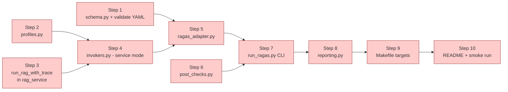

# Eval Pipeline — Implementation Plan (v2, build-ready)

> **Supersedes** v1 of this file. v2 reflects post-seed-data state and codebase entry points actually verified in `app/services/rag_service.py` + `app/models.py`.
> **Scope:** local-first eval harness. Sufficient to teach course Sections 4–6 and gate every advanced retrieval feature with measurable deltas.
> **Status:** ready to code. Each step has acceptance criteria + estimated effort.

---

## 0. Why v2 — what changed

| Topic | v1 assumption | v2 finding | Impact |
|-------|---------------|-----------|--------|
| `run_rag` return shape | returns chunks too | returns only `ChatResponse` (`answer`, `sources`, `confidence`, no chunk text) | New helper `run_rag_with_trace` needed to get chunk text for Ragas `context_precision/recall` |
| Sparse-only mode | works | `rag_service.py:68-78` falls back to hybrid when `search_mode="sparse"` | Goldens q-003 / q-004 won't show clean sparse-vs-dense delta until a real sparse-only path lands. Flag, don't block. |
| SQL invocation in service mode | call `run_rag` | SQL has its own `SQLService` class + `interrupt()` flow in graph | SQL goldens (q-017–q-020) run **only in Phase B** (API mode). Phase A skips them gracefully. |
| Web fallback in service mode | always available | needs `TAVILY_API_KEY` | Skip CRAG-fallback goldens if env missing; warn, don't crash. |
| `forbidden_keywords` on q-021 | Ragas handles | not a Ragas metric | Runner adds a separate post-check pass for security goldens. |

---

## 1. Goal

Ship a Ragas-based harness that, given a flag profile, runs the 21 goldens against the RAG pipeline and emits per-question + aggregate metrics. The harness must:

1. Make naive baseline failures visible on at least 1 golden per advanced feature category.
2. Make each advanced feature's improvement measurable and reproducible (`make eval` + `make eval-diff`).
3. Be cheap enough to re-run after every code change in Sections 4–6 (~$0.30 per full sweep).

Non-goals: CI integration, multi-turn eval, synthetic golden generation, adversarial corpus (lives in `tests/security/`).

---

## 2. Deliverables (Phase A — minimum for course)

```
eval/
├── IMPL_PLAN.md              # this file
├── README.md                 # user-facing quickstart
├── seed_questions.yaml       # already in place — 21 goldens
├── schema.py                 # Pydantic schema + validator for the YAML
├── profiles.py               # flag-profile registry
├── invokers.py               # ServiceInvoker, ApiInvoker (Phase B); abstracts call shape
├── ragas_adapter.py          # build Ragas Dataset + run evaluate
├── post_checks.py            # forbidden_keywords assertion + golden-vs-actual sources match
├── reporting.py              # markdown table + JSON dump
├── run_ragas.py              # CLI entry point
├── diff.py                   # Phase C — compare two result JSONs
└── results/
    └── .gitkeep              # gitignored otherwise
```

Plus:
- `app/services/rag_service.py` — add `run_rag_with_trace()` helper.
- `Makefile` — add `eval-*` targets.

---

## 3. Inputs already in place

| Input | State |
|-------|-------|
| `eval/seed_questions.yaml` (21 goldens) | done |
| Seed PDFs w/ embedded golden IDs (PROD-0099, ABC-12345, ORD-2024-0042) | done — `seed/docs/*.pdf` regenerated from .txt |
| Postgres seed (orders w/ `order_number`, `returns` table, Germany customers) | done — `seed/postgres_seed.sql` |
| `run_rag(question, flags)` entry point in `app/services/rag_service.py` | exists |
| Ragas in dev deps (`ragas>=0.2.0`) | exists — `pyproject.toml` |
| Adversarial footer in returns-sop.pdf | done |

---

## 4. Codebase entry points (verified)

```python
# app/services/rag_service.py
def run_rag(question: str, flags: dict | None = None) -> ChatResponse: ...

# app/models.py
class ChatResponse(BaseModel):
    answer: str
    sources: list[str]                # filenames only — no chunk text
    confidence: float
    cache_hit: bool = False
    cost_saved: str = "$0.00"
    pending_sql: PendingSQLBlock | None = None
    metadata: ResponseMetadata

class RetrievedChunk(BaseModel):
    text: str
    source: str
    score: float = 0.0

# app/services/sql_service.py
class SQLService: ...                  # NOT a function — graph-orchestrated
```

`RetrievedChunk` is the right shape for Ragas. We need `run_rag_with_trace` to return `(ChatResponse, list[RetrievedChunk])` so the adapter can pass `[c.text for c in chunks]` as `contexts`.

---

## 5. Architecture (full data path)

```mermaid
flowchart TB
    YAML[(seed_questions.yaml<br/>21 entries)] --> Validate[schema.py<br/>Pydantic load + validate]
    Validate --> Loop[for entry in goldens:]

    Loop --> SkipCheck{skip?<br/>SQL/hybrid in service mode<br/>OR web_fallback w/o TAVILY_API_KEY}
    SkipCheck -->|skip| Marker[record skipped<br/>w/ reason]
    SkipCheck -->|run| Inv[invokers.py<br/>ServiceInvoker.invoke]

    Inv --> Trace[run_rag_with_trace<br/>question, flags]
    Trace --> Pair[(ChatResponse, list[RetrievedChunk])]

    Pair --> Adapt[ragas_adapter.py<br/>build Dataset row]
    Pair --> Post[post_checks.py<br/>forbidden_keywords<br/>source overlap]

    Loop -->|all entries done| RagasRun[ragas.evaluate<br/>faithfulness, ctx_precision,<br/>ctx_recall, answer_relevancy]
    RagasRun --> Combine[merge ragas + post_check<br/>per-question + aggregate]
    Post --> Combine

    Combine --> Report[reporting.py]
    Report --> Stdout[markdown table on stdout]
    Report --> Json[(eval/results/<utc-ts>_<profile>.json)]

    Json -.consumed by.-> Diff[diff.py prev curr<br/>Phase C]
```

---

## 6. Build sequence (DAG)



S1–S10 are independent enough that a single dev can do them in ~1 day. Order matters only at S4 (needs S2+S3) and S7 (needs S5+S6).

---

## 7. Step-by-step build

### Step 1 — schema.py + YAML validator

**What:** Pydantic model for golden entries. Loader validates `seed_questions.yaml` and returns `list[Golden]`. Catches typos before the runner wastes API calls.

**Pseudocode:**

```python
# eval/schema.py
from typing import Literal
from pydantic import BaseModel, Field

INTENT = Literal["rag", "sql", "hybrid", "web_fallback"]
FEATURE = Literal[
    "baseline", "sparse", "dense", "hybrid", "rerank",
    "hyde", "crag", "self_rag", "sql", "hybrid_rag_sql", "security",
]

class Golden(BaseModel):
    id: str = Field(..., pattern=r"^q-\d{3}$")
    question: str = Field(..., min_length=1)
    intent: INTENT
    golden_sources: list[str] = Field(..., min_length=1)
    golden_answer_keywords: list[str] = Field(..., min_length=1)
    demonstrates_feature: FEATURE
    expected_baseline: Literal["pass", "fail"]
    expected_with_feature: Literal["pass"]
    notes: str
    forbidden_keywords: list[str] = Field(default_factory=list)

def load_goldens(path: str) -> list[Golden]:
    import yaml
    raw = yaml.safe_load(open(path))
    return [Golden.model_validate(e) for e in raw]
```

**Acceptance:**
- `python -c "from eval.schema import load_goldens; load_goldens('eval/seed_questions.yaml')"` returns 21 entries with no errors.
- IDs are unique (assert).
- Each `demonstrates_feature` category has ≥1 entry.

**Effort:** ~30 min.

---

### Step 2 — profiles.py

**What:** flag-profile registry. Single source of truth shared by eval runner + Streamlit V27 demo presets.

**Pseudocode:**

```python
# eval/profiles.py
PROFILES: dict[str, dict] = {
    "naive":              {"search_mode": "dense",  "enable_hyde": False, "enable_rerank": False, "enable_crag": False, "enable_self_reflective": False, "top_k": 5},
    "sparse_only":        {"search_mode": "sparse", "enable_hyde": False, "enable_rerank": False, "enable_crag": False, "enable_self_reflective": False, "top_k": 5},
    "hybrid":             {"search_mode": "hybrid", "enable_hyde": False, "enable_rerank": False, "enable_crag": False, "enable_self_reflective": False, "top_k": 5},
    "hybrid+rerank":      {"search_mode": "hybrid", "enable_hyde": False, "enable_rerank": True,  "enable_crag": False, "enable_self_reflective": False, "top_k": 5},
    "hybrid+rerank+hyde": {"search_mode": "hybrid", "enable_hyde": True,  "enable_rerank": True,  "enable_crag": False, "enable_self_reflective": False, "top_k": 5},
    "hybrid+rerank+crag": {"search_mode": "hybrid", "enable_hyde": False, "enable_rerank": True,  "enable_crag": True,  "enable_self_reflective": False, "top_k": 5},
    "all":                {"search_mode": "hybrid", "enable_hyde": True,  "enable_rerank": True,  "enable_crag": True,  "enable_self_reflective": True,  "top_k": 5},
}
```

**Acceptance:** import works; keys match the Streamlit preset list in `COURSE_PLAN_V2.md` Section 11.

**Effort:** ~15 min.

---

### Step 3 — `run_rag_with_trace` helper in rag_service

**What:** wrap existing `run_rag` so chunks are exposed for Ragas. Don't change public API.

**Pseudocode:**

```python
# app/services/rag_service.py — add at the bottom
from app.models import RetrievedChunk

def run_rag_with_trace(
    question: str,
    flags: dict | None = None,
) -> tuple[ChatResponse, list[RetrievedChunk]]:
    """Eval-friendly variant of run_rag that also returns the chunks used.

    Internally re-executes the retrieve → (rerank) → (CRAG) chain so the
    chunks captured here match what generation actually consumed. NOT
    intended for production traffic — only for eval/diagnostics.
    """
    flags = flags or {}
    # Replicate retrieval block from run_rag(), capture chunks before
    # spotlighting, then call the existing generation path. Simplest impl:
    # refactor run_rag's retrieval into a private _retrieve() that both
    # functions share. See Step 3a below.
```

**Step 3a — refactor:** extract `_retrieve(question, flags) -> list[RetrievedChunk]` from current `run_rag`, then `run_rag` and `run_rag_with_trace` both call it. Generation block stays in `run_rag`. `run_rag_with_trace` calls `_retrieve` itself, then calls a private `_generate(chunks, question, flags)`.

**Acceptance:**
- `run_rag_with_trace("test", {"search_mode": "dense"})` returns `(ChatResponse, list[RetrievedChunk])` with `len(chunks) > 0` after seed PDFs are ingested.
- `run_rag` behavior unchanged (existing tests still pass).

**Effort:** ~1 hr (the refactor is the bulk of it).

---

### Step 4 — invokers.py (service-mode + stub for api-mode)

**What:** abstract the call shape so the runner doesn't care if we're in service mode or API mode. Phase A ships service mode only; Phase B adds API mode.

**Pseudocode:**

```python
# eval/invokers.py
from abc import ABC, abstractmethod
from app.models import ChatResponse, RetrievedChunk
from app.services.rag_service import run_rag_with_trace

class Invoker(ABC):
    @abstractmethod
    def invoke(
        self, question: str, flags: dict, intent: str
    ) -> tuple[ChatResponse, list[RetrievedChunk]]: ...

class ServiceInvoker(Invoker):
    """Phase A — direct in-process call. SQL & hybrid intents are skipped."""
    SUPPORTED_INTENTS = {"rag", "web_fallback"}

    def invoke(self, question, flags, intent):
        if intent not in self.SUPPORTED_INTENTS:
            raise SkippedIntent(f"intent={intent} not supported in service mode")
        return run_rag_with_trace(question, flags)

class SkippedIntent(Exception): ...

# Phase B will add: ApiInvoker(base_url, token) — calls POST /query and
# auto-approves the pending_sql block via /query/sql/execute.
```

**Acceptance:** `ServiceInvoker().invoke(...)` returns `(ChatResponse, chunks)` for `rag`-intent goldens; raises `SkippedIntent` for `sql`/`hybrid` intents.

**Effort:** ~30 min.

---

### Step 5 — ragas_adapter.py

**What:** turn collected `(question, answer, contexts, ground_truth)` rows into a Ragas `Dataset` and run `evaluate`.

**Ground truth strategy:** Phase A synthesizes from `golden_answer_keywords` (`", ".join(keywords)`). Phase B can swap in hand-written `reference_answer` field per golden if quality demands.

**Pseudocode:**

```python
# eval/ragas_adapter.py
from datasets import Dataset
from ragas import evaluate
from ragas.metrics import (
    faithfulness, context_precision, context_recall, answer_relevancy,
)

def build_dataset(rows: list[dict]) -> Dataset:
    return Dataset.from_dict({
        "user_input":     [r["question"]    for r in rows],
        "response":       [r["answer"]      for r in rows],
        "retrieved_contexts": [r["contexts"] for r in rows],
        "reference":      [r["ground_truth"] for r in rows],
    })

METRICS = [faithfulness, context_precision, context_recall, answer_relevancy]

def run(rows: list[dict]) -> dict:
    ds = build_dataset(rows)
    result = evaluate(ds, metrics=METRICS)
    return result.to_pandas().to_dict(orient="records")  # per-row metrics
```

**Note:** Ragas 0.2.x renamed columns from `question/answer/contexts/ground_truth` to `user_input/response/retrieved_contexts/reference`. Verify on first run; swap names if version pins differ.

**Acceptance:** `run(rows)` for 2 hand-built rows returns 4 metrics per row in [0, 1].

**Effort:** ~45 min (mostly verifying the Ragas 0.2 column names against the installed version).

---

### Step 6 — post_checks.py

**What:** non-Ragas assertions per golden. For Phase A:

1. `forbidden_keywords` — answer must NOT contain any (q-021 security).
2. `source_overlap` — `set(actual.sources) & set(golden.golden_sources)` non-empty (informational, not gating).

**Pseudocode:**

```python
# eval/post_checks.py
def forbidden_keywords_check(answer: str, forbidden: list[str]) -> dict:
    hits = [kw for kw in forbidden if kw.lower() in answer.lower()]
    return {"passed": not hits, "hits": hits}

def source_overlap(actual: list[str], golden: list[str]) -> dict:
    actual_set = {s.lower() for s in actual}
    golden_set = {s.lower() for s in golden}
    overlap = actual_set & golden_set
    return {
        "overlap_pct": len(overlap) / max(len(golden_set), 1),
        "matched": sorted(overlap),
        "missed": sorted(golden_set - actual_set),
    }
```

**Acceptance:** unit-testable in isolation; q-021 with adversarial-leaked answer reports `passed=False, hits=["competitor"]`.

**Effort:** ~20 min.

---

### Step 7 — run_ragas.py main runner

**What:** the CLI. Loads goldens, applies filters, invokes per entry, runs Ragas, runs post-checks, dumps report.

**Pseudocode:**

```python
# eval/run_ragas.py
import argparse, datetime, json, os
from pathlib import Path
from eval.schema import load_goldens
from eval.profiles import PROFILES
from eval.invokers import ServiceInvoker, SkippedIntent
from eval import ragas_adapter, post_checks, reporting

def main():
    ap = argparse.ArgumentParser()
    ap.add_argument("--profile", required=True, choices=list(PROFILES.keys()))
    ap.add_argument("--questions", default="eval/seed_questions.yaml")
    ap.add_argument("--filter", default=None,
                    help="only run goldens with demonstrates_feature == FILTER (plus baseline)")
    ap.add_argument("--mode", default="service", choices=["service", "api"])
    ap.add_argument("--output", default=None)
    args = ap.parse_args()

    flags = PROFILES[args.profile]
    goldens = load_goldens(args.questions)
    if args.filter:
        goldens = [g for g in goldens
                   if g.demonstrates_feature in (args.filter, "baseline")]

    invoker = ServiceInvoker() if args.mode == "service" else None
    # Phase B: ApiInvoker(...) when mode == "api"

    rows = []
    skipped = []
    for g in goldens:
        try:
            resp, chunks = invoker.invoke(g.question, flags, g.intent)
        except SkippedIntent as e:
            skipped.append({"id": g.id, "reason": str(e)}); continue
        except Exception as e:
            skipped.append({"id": g.id, "reason": f"error: {e}"}); continue

        rows.append({
            "id": g.id,
            "demonstrates_feature": g.demonstrates_feature,
            "intent": g.intent,
            "question": g.question,
            "answer": resp.answer,
            "contexts": [c.text for c in chunks],
            "ground_truth": ", ".join(g.golden_answer_keywords),
            "actual_sources": resp.sources,
            "golden_sources": g.golden_sources,
            "forbidden_keywords": g.forbidden_keywords,
        })

    metrics = ragas_adapter.run(rows) if rows else []
    for row, m in zip(rows, metrics):
        row["ragas_metrics"] = m
        row["forbidden_check"] = post_checks.forbidden_keywords_check(
            row["answer"], row["forbidden_keywords"]
        )
        row["source_overlap"] = post_checks.source_overlap(
            row["actual_sources"], row["golden_sources"]
        )

    out_path = (Path(args.output) if args.output
                else Path(f"eval/results/{datetime.datetime.utcnow():%Y%m%dT%H%M%SZ}_{args.profile}.json"))
    out_path.parent.mkdir(parents=True, exist_ok=True)

    payload = {
        "profile": args.profile,
        "flags": flags,
        "timestamp_utc": datetime.datetime.utcnow().isoformat() + "Z",
        "filter": args.filter,
        "mode": args.mode,
        "rows": rows,
        "skipped": skipped,
        "aggregate": reporting.aggregate(rows),
    }
    out_path.write_text(json.dumps(payload, indent=2, default=str))
    reporting.print_table(payload)
    print(f"\nWrote: {out_path}")

if __name__ == "__main__":
    main()
```

**Acceptance:** `python -m eval.run_ragas --profile naive` produces a JSON file in `eval/results/` and prints a table.

**Effort:** ~1.5 hr.

---

### Step 8 — reporting.py

**What:** aggregate + pretty-print. Markdown table on stdout w/ per-question rows + an aggregate row.

**Pseudocode:**

```python
# eval/reporting.py
from statistics import mean

METRIC_KEYS = ["faithfulness", "context_precision", "context_recall", "answer_relevancy"]

def aggregate(rows: list[dict]) -> dict:
    out = {}
    for k in METRIC_KEYS:
        vals = [r["ragas_metrics"].get(k) for r in rows
                if r.get("ragas_metrics") and r["ragas_metrics"].get(k) is not None]
        out[k] = round(mean(vals), 3) if vals else None
    out["forbidden_violations"] = sum(
        1 for r in rows if not r["forbidden_check"]["passed"]
    )
    out["evaluated"] = len(rows)
    return out

def print_table(payload: dict) -> None:
    print(f"\n## Eval — profile={payload['profile']} mode={payload['mode']}")
    print(f"Skipped: {len(payload['skipped'])}\n")
    print("| id | feature | faith | ctx_prec | ctx_recall | ans_rel | forbidden |")
    print("|----|---------|-------|----------|------------|---------|-----------|")
    for r in payload["rows"]:
        m = r.get("ragas_metrics") or {}
        fb = "OK" if r["forbidden_check"]["passed"] else f"FAIL: {r['forbidden_check']['hits']}"
        print(f"| {r['id']} | {r['demonstrates_feature']} | "
              f"{m.get('faithfulness', 0):.2f} | {m.get('context_precision', 0):.2f} | "
              f"{m.get('context_recall', 0):.2f} | {m.get('answer_relevancy', 0):.2f} | {fb} |")
    a = payload["aggregate"]
    print(f"| **AGG** | — | **{a['faithfulness']}** | **{a['context_precision']}** | "
          f"**{a['context_recall']}** | **{a['answer_relevancy']}** | "
          f"violations={a['forbidden_violations']} |")
```

**Acceptance:** running `--profile naive` emits a readable table; aggregates correct vs hand-computed mean.

**Effort:** ~30 min.

---

### Step 9 — Makefile targets

```makefile
.PHONY: eval eval-baseline eval-hybrid eval-rerank eval-hyde eval-crag eval-all eval-diff

eval-baseline:
	uv run python -m eval.run_ragas --profile naive

eval-hybrid:
	uv run python -m eval.run_ragas --profile hybrid

eval-rerank:
	uv run python -m eval.run_ragas --profile hybrid+rerank

eval-hyde:
	uv run python -m eval.run_ragas --profile hybrid+rerank+hyde --filter hyde

eval-crag:
	uv run python -m eval.run_ragas --profile hybrid+rerank+crag --filter crag

eval-all:
	uv run python -m eval.run_ragas --profile all

eval: eval-baseline eval-all
	$(MAKE) eval-diff

eval-diff:
	@latest_naive=$$(ls -t eval/results/*_naive.json 2>/dev/null | head -1); \
	latest_all=$$(ls -t eval/results/*_all.json 2>/dev/null | head -1); \
	test -n "$$latest_naive" && test -n "$$latest_all" && \
	  uv run python -m eval.diff $$latest_naive $$latest_all || \
	  echo "Need at least one _naive.json and one _all.json in eval/results/"
```

**Acceptance:** `make eval-baseline` runs end-to-end against a stack with seed PDFs ingested.

**Effort:** ~15 min.

---

### Step 10 — README.md + smoke run

**What:** quickstart so the next person (or a learner watching V9) can run eval in 5 minutes.

Content (already drafted in `COURSE_PLAN_V2.md` V9):
1. Spin up local stack — `docker compose up -d`.
2. Seed DB — `uv run python scripts/seed_db.py`.
3. Generate PDFs — `uv run python seed/docs/generate_pdfs.py`.
4. Upload seed PDFs — `for f in seed/docs/*.pdf; do curl ... ; done`.
5. Run baseline — `make eval-baseline`.
6. Run all-features — `make eval-all`.
7. Diff — `make eval-diff`.
8. Inspect `eval/results/*.json`.

**Smoke run acceptance:** baseline JSON shows ≥4 goldens with `context_recall < 0.5` (proves the goldens expose real gaps); `all` profile shows aggregate `faithfulness ≥ 0.80`.

**Effort:** ~30 min for README; smoke run depends on stack readiness.

---

## 8. Phase B additions (after course Section 7 — API hardening)

Switch default `--mode` to `api`. SQL + hybrid goldens become runnable.

```python
# eval/invokers.py — add ApiInvoker
import httpx, os
from app.models import RetrievedChunk

class ApiInvoker(Invoker):
    SUPPORTED_INTENTS = {"rag", "sql", "hybrid", "web_fallback"}

    def __init__(self, base_url: str = None, token: str = None):
        self.base = base_url or os.getenv("EVAL_API_BASE", "http://localhost:8000")
        self.token = token or os.environ["EVAL_API_TOKEN"]

    def invoke(self, question, flags, intent):
        h = {"Authorization": f"Bearer {self.token}"}
        body = httpx.post(f"{self.base}/query",
                          json={"question": question, **flags},
                          headers=h, timeout=120).json()
        if body.get("pending_sql"):
            body = httpx.post(f"{self.base}/query/sql/execute",
                              json={"query_id": body["pending_sql"]["query_id"], "approved": True},
                              headers=h, timeout=120).json()
        # Need a /query response that surfaces retrieved chunks for Ragas.
        # Either: extend ChatResponse with optional .metadata.trace.chunks
        # in eval mode (header X-Eval-Trace: true), or run a parallel
        # service-mode call just to get chunks. Decision deferred.
```

**Open issue for Phase B:** `ChatResponse` does not expose chunks. Options:
- (a) Extend `ResponseMetadata` with optional `trace_chunks` populated when a special header is set. Cleanest.
- (b) For each entry, call API for the answer + service mode for chunks separately. Doubles cost; rejected.
- (c) Add `/eval/query` endpoint that returns chunks. Simplest impl but pollutes API surface.

Decide before Phase B — recommend (a).

---

## 9. Phase C additions (Phase 4 of code build)

`eval/diff.py`:

```python
import json, sys
prev = json.loads(open(sys.argv[1]).read())
curr = json.loads(open(sys.argv[2]).read())
print(f"\n## Diff — {prev['profile']} → {curr['profile']}\n")
print("| metric | prev | curr | Δ |")
print("|---|---|---|---|")
for k in ("faithfulness", "context_precision", "context_recall", "answer_relevancy"):
    p, c = prev["aggregate"][k], curr["aggregate"][k]
    if p is None or c is None: continue
    print(f"| {k} | {p:.3f} | {c:.3f} | {c-p:+.3f} |")
```

Threshold gating (advisory only — don't fail CI in Phase C):

```python
THRESHOLDS = {"faithfulness": 0.85, "context_precision": 0.75,
              "context_recall": 0.70, "answer_relevancy": 0.80}
```

Print pass/fail per metric at end of each run.

---

## 10. Acceptance test ladder (cumulative)

| After step | Smoke check |
|------------|-------------|
| S1 | `load_goldens()` returns 21 entries; assertion: each `demonstrates_feature` category present. |
| S2 | `PROFILES["naive"]` and `PROFILES["all"]` exist; flag keys match `QueryRequest` fields. |
| S3 | `run_rag_with_trace("warranty?", {})` returns chunks containing the literal `1-year`. |
| S4 | `ServiceInvoker().invoke(...)` runs for q-001; raises `SkippedIntent` for q-017. |
| S5 | `ragas_adapter.run([row1, row2])` emits 4 metric scores per row, all in [0, 1]. |
| S6 | `forbidden_keywords_check("our competitor X is better", ["competitor"])` → `passed=False`. |
| S7 | `python -m eval.run_ragas --profile naive` writes one JSON file in `eval/results/`. |
| S8 | The printed table has one row per non-skipped golden + an AGG row. |
| S9 | `make eval-baseline` exits 0 and produces output. |
| S10 | Smoke gate: baseline shows `context_recall < 0.5` on ≥4 goldens; `all` profile aggregate `faithfulness ≥ 0.80`. |

---

## 11. Risks + mitigations

| Risk | Likelihood | Impact | Mitigation |
|------|------------|--------|------------|
| Sparse-only path not implemented (`rag_service.py:68-78` falls back to hybrid) | high | sparse goldens (q-003, q-004) won't show clean delta vs hybrid in `sparse_only` profile | Document as known gap. Add issue. Sparse demo still works in Streamlit (V11) by toggling between `sparse_only`-but-hybrid and `naive` (dense). Real fix is a 1-day patch to `vector_store.search` to expose a sparse-only path. |
| Ragas 0.2.x column names drift | medium | runner emits empty metrics | Pin `ragas==0.2.x` exactly; add a smoke unit test that builds a 2-row Dataset and verifies all 4 metrics are returned. |
| `TAVILY_API_KEY` missing locally | medium | CRAG-fallback goldens (q-013, q-014) error | `ServiceInvoker` checks env var; raises `SkippedIntent("tavily_unset")` if missing. |
| `run_rag_with_trace` refactor breaks existing tests | medium | Phase 1 regressions | Refactor as additive: `_retrieve` + `_generate` extracted, original `run_rag` body shrinks to call them. Run `pytest tests/` before merging. |
| Python 3.14 vs project lock | medium | `uv sync --extra dev` fails (spacy 3.8 wheel missing) | `uv python pin 3.12` in repo root, OR document `pip install -e ".[dev]"` fallback. |
| Cost overrun on repeated eval runs | low | OpenAI bill | Budget alert at $10 in OpenAI account; cache Ragas grader prompts via Upstash (Phase 4 cache layer covers this for Ragas if desired). |
| `forbidden_keywords` false negative on q-021 | low | security regression undetected | Make the check case-insensitive AND substring (already does). Add unit test in `tests/security/`. |

---

## 12. Cost + timing budget

### Per-run cost (OpenAI)

| Profile | Goldens run (Phase A) | Ragas calls | Estimated $ |
|---------|----------------------|-------------|-------------|
| naive | 17 (skips 4 SQL/hybrid) | ~200 | $0.06 |
| hybrid | 17 | ~200 | $0.06 |
| hybrid+rerank | 17 | ~200 | $0.06 |
| hybrid+rerank+hyde | 17 (extra LLM call per Q for HyDE) | ~250 | $0.08 |
| hybrid+rerank+crag | 17 (extra grader LLM per Q) | ~250 | $0.08 |
| all | 17 (HyDE + CRAG + reflect cycles) | ~350 | $0.12 |
| **full sweep (6 profiles)** | — | — | **~$0.46** |

In Phase B (API mode), all 21 goldens run → +$0.10 per profile.

### Build effort

| Step | Effort | Cumulative |
|------|--------|------------|
| S1 schema | 30 min | 0.5 h |
| S2 profiles | 15 min | 0.75 h |
| S3 trace helper + refactor | 60 min | 1.75 h |
| S4 invokers | 30 min | 2.25 h |
| S5 ragas adapter | 45 min | 3 h |
| S6 post-checks | 20 min | 3.3 h |
| S7 runner CLI | 90 min | 4.8 h |
| S8 reporting | 30 min | 5.3 h |
| S9 Makefile | 15 min | 5.5 h |
| S10 README + smoke | 30 min | 6 h |

**Total Phase A: ~1 working day** for one engineer who knows the codebase.

Phase B add-on: ~3 hours (ApiInvoker + `ChatResponse.metadata.trace_chunks` plumbing).
Phase C add-on: ~1 hour (diff + threshold print).

---

## 13. Course-video alignment

| Video | What it shows from this plan |
|-------|------------------------------|
| **V8** | Why eval; Ragas 4 metrics; golden dataset design; show `eval/seed_questions.yaml` walkthrough; show schema.py validating it. |
| **V9** | Build session: code S1–S10 live (or condensed); run `make eval-baseline`; show baseline failures in the table; promise the next videos fix specific metrics. |
| **V11** (hybrid) | `make eval-baseline` → run with `--profile hybrid` → show `context_recall` lift on q-003/q-004/q-007/q-008. |
| **V12** (rerank) | `--profile hybrid+rerank` → show `context_precision` lift on q-009/q-010. |
| **V13** (HyDE) | `--profile hybrid+rerank+hyde --filter hyde` → show `context_recall` lift on q-011/q-012. |
| **V14** (CRAG) | `--profile hybrid+rerank+crag --filter crag` → show `faithfulness` lift on q-013/q-014. |
| **V15** (Self-RAG) | `--profile all --filter self_rag` → show `answer_relevancy` lift on q-015/q-016. |

Each video runs the harness LIVE on camera for ~30 sec → much more compelling than slide-only claims.

---

## 14. Definition of Done — Phase A

- [ ] All 10 build steps shipped.
- [ ] `make eval-baseline` and `make eval-all` both produce JSON in `eval/results/`.
- [ ] Baseline shows ≥1 golden failure per advanced-feature category — proves goldens expose real gaps.
- [ ] `all` profile aggregate metrics: `faithfulness ≥ 0.80`, `context_precision ≥ 0.70`, `context_recall ≥ 0.65`, `answer_relevancy ≥ 0.75`.
- [ ] q-021 forbidden-keywords check passes (no competitor leak) on `naive` profile w/ spotlighting + sys-prompt active.
- [ ] `eval/README.md` quickstart runnable end-to-end by someone who hasn't seen the code.
- [ ] Course videos V11–V15 can each demo the relevant `--profile` + `--filter` combo live.
- [ ] No new test failures in `pytest tests/`.

When the box above is fully checked, the eval pipeline is **sufficient to teach Sections 4–6** of `COURSE_PLAN_V2.md`. Phases B/C/D are nice-to-haves and can land alongside the corresponding code phase.

---

## 15. Open follow-ups (track separately)

1. **Implement true sparse-only retrieval** — patch `rag_service.py:68-78` and `vector_store.search` so `search_mode="sparse"` doesn't fall through to hybrid. Required for clean q-003/q-004 demos.
2. **Add `ResponseMetadata.trace_chunks`** — opt-in via header `X-Eval-Trace: true`. Required for Phase B.
3. **Pin Python 3.12 in repo** — avoids the cp314 wheel issue we hit when generating PDFs.
4. **Hand-write `reference_answer` per golden** — currently synthesized from keywords. Improves Ragas `answer_relevancy` quality at the cost of one-time author effort (~2 hours for 21 goldens).
5. **Wire eval into CI on tag-push only** — Phase D. Compare to baseline-on-main artifact; post diff table as commit comment.
