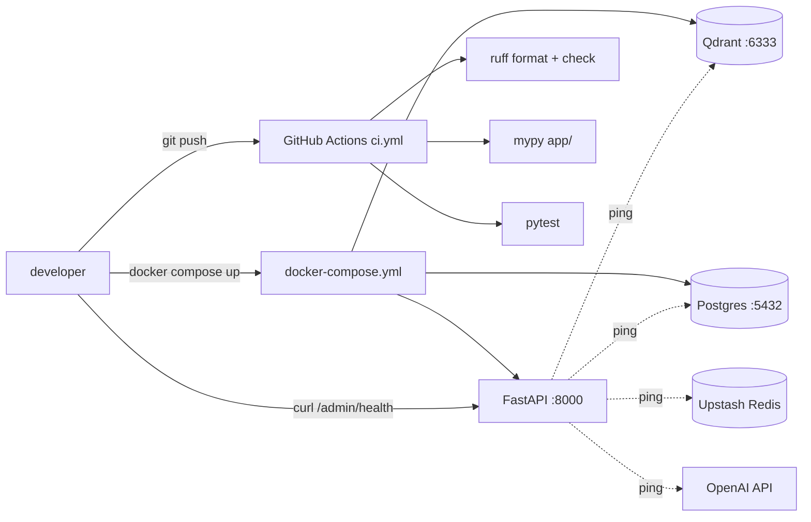

# #1 — Repo scaffold + `/admin/health`

## Parent PRD

#<prd-issue-number-tbd>

## What to build

The empty foundation every later slice builds on. A `docker compose up` brings up Postgres, Qdrant, and the FastAPI app; a `curl /admin/health` returns `200` with each dependency probed. CI runs lint + type check + tests on every push. The `.gitmessage` template is committed and `git config commit.template .gitmessage` is documented in the README.

This slice does **not** yet implement auth, the graph, or any retrieval. It establishes the repo as a working dev environment.

## Topology

## Acceptance criteria

- [ ] `pyproject.toml` declares all Phase 1 deps pinned (FastAPI, uvicorn, pydantic, pydantic-settings, loguru, langgraph, langgraph-checkpoint-postgres, qdrant-client, openai, vanna, psycopg2-binary, upstash-redis, docling, sentence-transformers, tavily-python, llm-guard, tiktoken, passlib[bcrypt], pyjwt, ragas).
- [ ] `Dockerfile` (CPU, multi-stage, layer-cache-friendly per `docs/03_DEPLOYMENT_STRATEGY.md` §3.2).
- [ ] `docker-compose.yml` brings up `app`, `qdrant`, `postgres`. `app` depends on the other two and waits for healthchecks.
- [ ] `app/main.py` mounts FastAPI with one route: `GET /admin/health`. Response: `{"status": "ok|degraded", "qdrant": bool, "postgres": bool, "redis": bool, "openai": bool}`.
- [ ] `app/config.py` loads via `pydantic_settings.BaseSettings` from `.env`. `.env.example` enumerates every key from `IMPLEMENTATION_PLAN.md` §4.
- [ ] `scripts/serve.py` is the uvicorn entry (single worker, `log_config=None`).
- [ ] `loguru` writes to stdout, JSON when `LOG_JSON=true`.
- [ ] `.github/workflows/ci.yml` runs `ruff format --check`, `ruff check`, `mypy app/`, `pytest` on every push and PR.
- [ ] `.gitmessage` template committed at repo root; README documents `git config commit.template .gitmessage`.
- [ ] `tests/unit/test_imports.py` does a no-op import of every top-level module — green.
- [ ] `docker compose up` brings the stack up with no errors; `curl http://localhost:8000/admin/health` returns 200.
- [ ] All commits follow the convention from `IMPLEMENTATION_PLAN.md` §12 (Conventional Commits + `[phase-1]`).

## Blocked by

None — can start immediately.

## User stories addressed

- 56 (`/admin/health` deps-aware)
- 62 (`docker compose up` brings up full stack)
- 63 (Conventional Commits + phase tag)
- 65 (CHANGELOG.md scaffolded)

## Phase tag

`[phase-1]`. Eligible for `phase-1-skeleton` milestone (along with #5 and #6).
