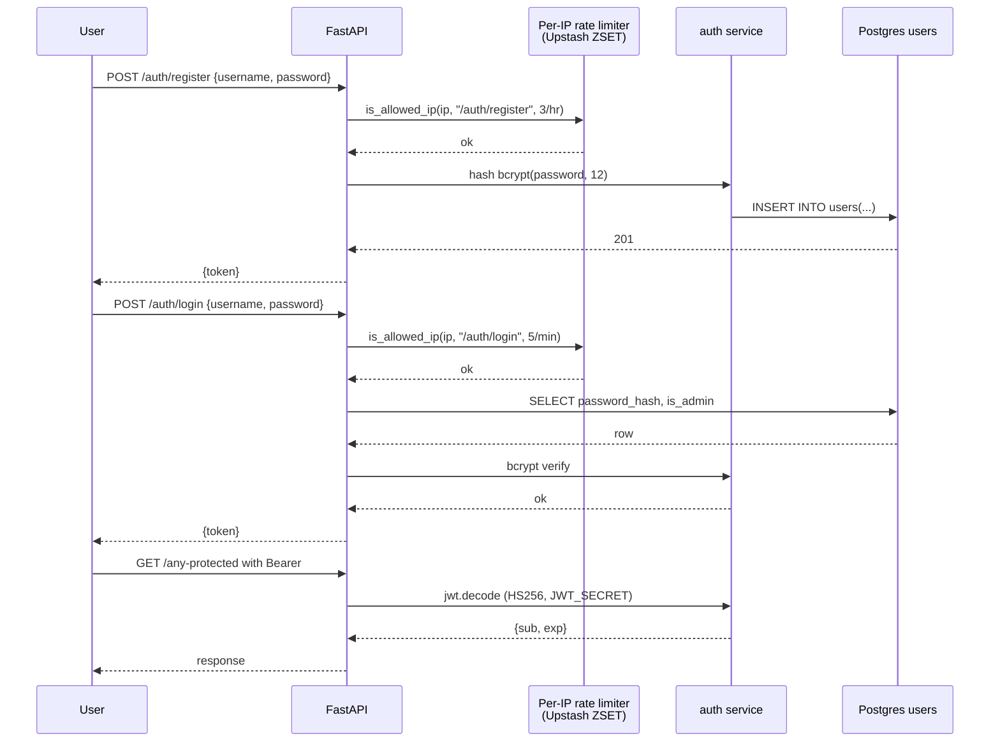

# #2 — Auth foundation (register, login, JWT, users table, per-IP rate limit on `/auth`)

## Parent PRD

#<prd-issue-number-tbd>

## What to build

The complete authentication slice end-to-end: a user can `POST /auth/register`, then `POST /auth/login`, receive a JWT, and use it as a Bearer token. The `users` table is created with a Postgres migration. Bcrypt hashes passwords. Per-IP rate limit protects `/auth/login` (5/min) and `/auth/register` (3/hour) before the bcrypt round.

This is the only slice that touches user identity. Once it lands, every subsequent route relies on `get_current_user` as a FastAPI dependency.

## Topology

## Acceptance criteria

- [ ] `users` table created via a SQL migration in `seed/migrations/`: `(id SERIAL PK, username VARCHAR(64) UNIQUE, password_hash TEXT, is_admin BOOLEAN DEFAULT FALSE, created_at TIMESTAMPTZ DEFAULT now())`.
- [ ] `scripts/seed_db.py` is idempotent and seeds two demo users: `agent@demo.local` (regular) and `admin@demo.local` (`is_admin=true`).
- [ ] `app/middleware/auth.py` exposes `create_access_token(username) -> str` and `get_current_user` FastAPI dependency that decodes Bearer tokens and returns a `User` object including `is_admin`.
- [ ] JWT uses HS256, 60-minute expiry, `JWT_SECRET` from env.
- [ ] Bcrypt cost factor 12 (via `passlib`).
- [ ] `app/middleware/rate_limiter.py` exposes `is_allowed_ip(ip, key, limit, window_seconds)` using sliding-window Redis ZSET.
- [ ] `app/api/auth.py` mounts `POST /auth/register` and `POST /auth/login`. Both apply per-IP rate limit middleware before the bcrypt round.
- [ ] Expired token → `401`. Tampered token → `401`. Missing token on protected route → `401`.
- [ ] Unit tests in `tests/unit/middleware/test_auth.py`: JWT issue/verify roundtrip, expired rejected, tampered rejected, bcrypt verify works.
- [ ] Unit tests in `tests/unit/middleware/test_rate_limiter.py`: sliding window math, per-IP keyspace isolation, boundary case.
- [ ] Integration test in `tests/integration/test_auth_flow.py`: register → login → use Bearer → get protected resource.
- [ ] 6 `/auth/login` calls from same IP within 60s → 6th gets `429`.
- [ ] 4 `/auth/register` calls from same IP within an hour → 4th gets `429`.

## Blocked by

- Blocked by #1 (repo scaffold, Postgres up, FastAPI mounted)

## User stories addressed

- 1 (register)
- 2 (login → JWT)
- 3 (JWT 60-min expiry)
- 4 (`401` on unauth)
- 6 (per-IP rate limit on `/auth/*`)

## Phase tag

`[phase-0]`. Eligible for `phase-0-baseline` milestone (along with #3 and #4).
