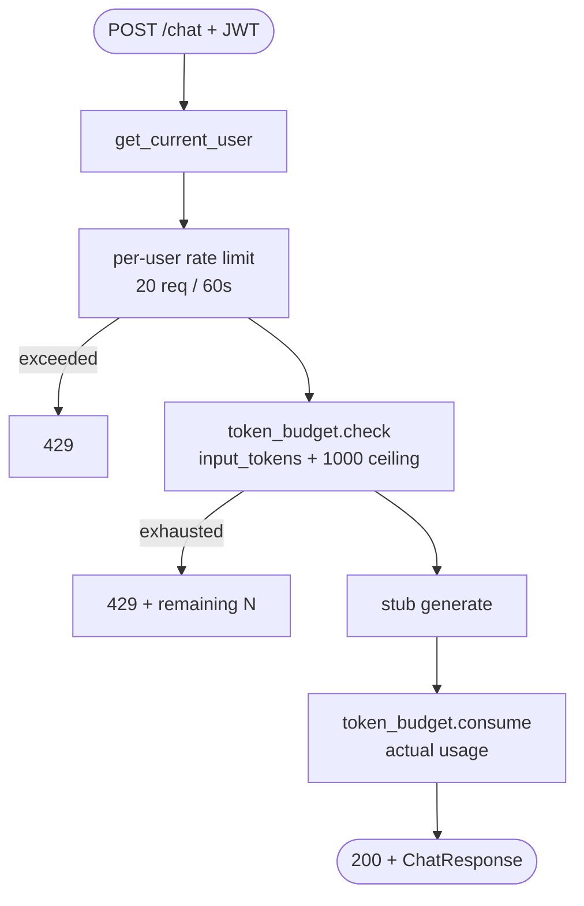

# #3 — Per-user rate limit + daily token budget on stub `/chat`

## Parent PRD

#<prd-issue-number-tbd>

## What to build

The two cost-control gates that protect everything downstream: per-user sliding-window rate limit (20 req/min) and per-user daily token budget (100k tokens/day, capped pre-LLM with `input + 1000-token output ceiling`). To exercise both end-to-end, a stub `POST /chat` endpoint that just returns `{"answer": "stub", "cache_hit": false, "cost_saved": "$0.00", ...}` and consumes a fake `tokens_charged` value. The graph + real LLM wiring lands in #4.

## Topology

## Acceptance criteria

- [ ] `app/middleware/rate_limiter.py` extended with `is_allowed_user(user_id, limit=20, window_seconds=60)`. Per-user Redis keyspace `rate_limit:user:{username}`.
- [ ] `app/security/token_budget.py` — `check_budget(user_id, estimated_tokens) -> (ok, remaining)` and `consume(user_id, actual_tokens) -> {used, limit, remaining, tokens_charged}`. Redis key `token_budget:{user_id}:{YYYY-MM-DD}` with TTL set to seconds-until-midnight.
- [ ] `check_budget` estimate = `tiktoken_count(message) + RESERVED_OUTPUT_TOKENS` (default 1000, env-configurable).
- [ ] When budget would be exceeded, error body matches the format: *"You have N tokens remaining today; this request estimated to use M."*
- [ ] Stub `POST /chat` route in `app/api/chat.py` (will be replaced by `/query` graph in #4 — keep the endpoint name and shape consistent so middleware wiring carries over).
- [ ] Per-user rate limit is wired as middleware on the stub endpoint; per-IP rate limit (from #2) is NOT applied here.
- [ ] Unit tests: `tests/unit/middleware/test_rate_limiter.py` covers the per-user case; `tests/unit/security/test_token_budget.py` covers check + consume + TTL math.
- [ ] Integration test: 21 `/chat` calls within 60s → 21st gets `429`. Setting a user's budget to 100 then sending a message that estimates 200 tokens → `429` with the exact remaining number in the message.
- [ ] Budget counter resets at midnight UTC (verifiable via TTL inspection).

## Blocked by

- Blocked by #2 (auth — need `get_current_user` to identify the user)

## User stories addressed

- 5 (per-user 20/min sliding window)
- 7 (daily token budget with input+1000 ceiling)
- 8 (clear budget-exhausted error message)

## Phase tag

`[phase-0]`.
