# #5 — Naïve RAG path (upload → Docling → Qdrant dense → spotlight → generate)

## Parent PRD

#<prd-issue-number-tbd>

## What to build

The first end-to-end RAG flow. A user uploads a PDF; the system parses it with Docling, chunks via `HybridChunker`, embeds each chunk with `text-embedding-3-small`, and upserts into a Qdrant collection with **dense vectors only** (sparse vectors land in #7). On `POST /query` (with the Phase-1 stub router still forcing `"rag"` intent), the graph embeds the question, runs cosine top-k search, spotlights the chunks, and generates a cited answer.

After this slice, real RAG works end-to-end: upload one of the seed policy PDFs, ask *"What's our return policy for opened items?"*, get a grounded answer with `sources: ["refund-policy.pdf"]`.

## Topology

```mermaid
flowchart TB
    subgraph Upload["POST /documents/upload"]
        U[multipart PDF] --> Parse[Docling parse]
        Parse --> Chunk[HybridChunker]
        Chunk --> Emb[OpenAI embed batch]
        Emb --> Up[Qdrant upsert<br/>dense vector + payload]
    end

    subgraph Query["POST /query (intent='rag')"]
        Q[question] --> EmbQ[embed question]
        EmbQ --> Search[Qdrant search<br/>cosine top_k=5]
        Search --> Chunks[RetrievedChunks]
        Chunks --> Spot[spotlighting wrapper]
        Spot --> Gen[generate_answer<br/>system + spotlighted + question]
        Gen --> Resp[ChatResponse with sources]
    end
```

## Acceptance criteria

- [ ] `app/services/document_processor.py` — Docling parse + `docling.chunking.HybridChunker`. Mirrors `ProjectForContext/corrective_self_reflective_rag/app/services/document_processor.py`.
- [ ] `app/services/embedding_service.py` — `embed_one(text)`, `embed_batch(texts)` against `text-embedding-3-small`. No caching yet — that's #14.
- [ ] `app/services/vector_store.py` — Qdrant client. Collection `documents` with single dense vector (1536-d, cosine). Methods: `upsert(chunks, metadatas)`, `search_dense(query_vector, top_k=5)`. Returns `list[RetrievedChunk]`.
- [ ] `app/models.py` — `RetrievedChunk(content, metadata, score)` and `ChunkMetadata(chunk_id, source_file, file_type, chunk_index, total_chunks, ...)`.
- [ ] `app/services/rag_service.py` — orchestrates `embed_question → vector_store.search_dense → spotlighting.build → llm_service.generate`. Returns `(answer, sources)`.
- [ ] `app/core/graph.py` — extend Phase-1 stub graph: `route_intent → vector_search → spotlight → generate_answer → END`. The `route_intent` stub still always returns `"rag"` — replaced by real router in #10.
- [ ] `app/api/upload.py` — `POST /documents/upload` (Bearer JWT, multipart). Synchronous: parse + chunk + embed + upsert. Returns `{doc_id: sha256(file_bytes), chunks_indexed: int}`. No security pipeline yet (that's #17).
- [ ] `seed/docs/` — synthesize 5 PDFs: `refund-policy.pdf`, `shipping-policy.pdf`, `warranty.pdf`, `returns-sop.pdf`, `faq.pdf`. ~1 page each, consistent with `seed/postgres_seed.sql` numbers (`shipping_days`, `refund_window_days`, etc.). `returns-sop.pdf` contains the deliberate hidden injection payload — but the *protection* against it lands in spotlighting (already done in #4) and content moderation (#16); the seeded payload itself is just data. Document in `seed/docs/README.md`.
- [ ] Unit tests: `tests/unit/services/test_vector_store.py` (search shape), `test_document_processor.py` (chunk count > 0), `test_rag_service.py` (combines search + spotlight + generate).
- [ ] Integration test: upload `refund-policy.pdf`, ask *"What's our return policy for opened items?"*, response answer is non-empty AND `sources` includes `refund-policy.pdf` AND confidence > 0.5.
- [ ] LangGraph diagram (`graph.get_graph().draw_mermaid()`) shows `route_intent → vector_search → spotlight → generate_answer`.

## Blocked by

- Blocked by #4 (graph skeleton + spotlighting + output validator)

## User stories addressed

- 20 (RAG with cited sources)
- 21 (confidence in response)
- 34 (PDF upload)
- 37 (10MB size limit — wired here, full security pipeline in #17)
- 39 (SHA-256 file hash — `doc_id` is the hash; full dedup behavior in #15)
- 40 (spotlighting protects retrieved chunks — already wrapped from #4, exercised here)
- 41 (synchronous upload)

## Phase tag

`[phase-1]`. Eligible for `phase-1-skeleton` milestone.
