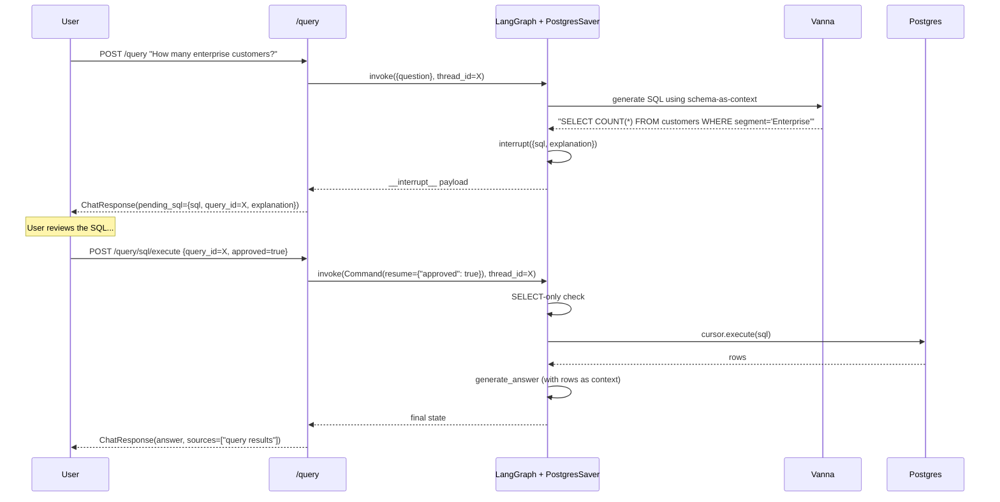

# #6 — SQL path via Vanna + LangGraph `interrupt()` for approval

## Parent PRD

#<prd-issue-number-tbd>

## What to build

The two-endpoint SQL approval workflow built on LangGraph's native `interrupt()` (per `IMPLEMENTATION_PLAN.md` §11.5). Vanna 2.0 generates SQL using a schema-as-context prompt built by introspecting `information_schema.columns` at startup. The graph node calls `interrupt({sql, explanation})`; `query_id` IS the LangGraph `thread_id`. Calling `POST /query/sql/execute` with `{query_id, approved}` resumes via `Command(resume=...)`. SELECT-only enforcement at the execution node — DML rejected even if the LLM emits it.

Phase-1 router stub is extended to recognize a hardcoded "SQL trigger" (e.g. messages containing `count(`, `total`, `customers`, `orders`) so this slice is testable before the LLM router lands in #10.

## Topology

## Acceptance criteria

- [ ] `app/services/sql_service.py` — Vanna 2.0 wrapper. `_build_schema_context()` introspects `information_schema.columns` at startup, caches the string in memory. `generate_sql_async(question)` returns `(sql, explanation)` via Vanna's stream.
- [ ] `seed/postgres_seed.sql` — 50 customers (with `segment` in {SMB, Enterprise, Individual}, country), 200 orders, 30 products, 5 tickets. Idempotent.
- [ ] `app/core/graph.py` — extend with `vanna_generate_sql` and `execute_sql` nodes. `vanna_generate_sql` calls `interrupt({type, sql, explanation})`. After resume, if `approved == true`, flow continues to `execute_sql`; if `false`, flow goes to a `rejected` END.
- [ ] `app/core/graph.py` — extend `route_intent` stub: keyword-trigger SQL intent on words {`count`, `total`, `customers`, `orders`, `revenue`, `top`}. Otherwise stay on RAG. (LLM router replaces this in #10.)
- [ ] `execute_sql` node: hard-rejects any statement that doesn't `strip().upper().startswith("SELECT")`. Even if the LLM emitted DML, it's blocked here. Returns rows via psycopg2.
- [ ] `app/api/query.py` — when graph returns `__interrupt__`, build a `ChatResponse` with `pending_sql=PendingSQLBlock(sql, query_id=thread_id, explanation)` and partial answer text like *"Generated SQL ready for approval."*
- [ ] `app/api/query.py` — `POST /query/sql/execute` route accepts `{query_id, approved}`, resumes graph with `Command(resume={"approved": ...})`, returns final `ChatResponse`.
- [ ] On execution error (SQL syntax, FK violation, etc.), surface `400 Bad Request` with the Postgres error message — not a generic 500.
- [ ] Unit tests: `tests/unit/services/test_sql_service.py` — schema introspection works, schema-context string includes all seeded tables, SELECT-only check rejects `DELETE FROM customers`.
- [ ] Integration test: full two-step roundtrip. *"How many enterprise customers in Germany?"* returns a `pending_sql` block; calling `/query/sql/execute` with `approved=true` returns the row count.
- [ ] Integration test (rejected): same flow with `approved=false` returns `ChatResponse` with `answer` indicating cancellation, no DB call made.
- [ ] Integration test (LLM-emitted DML): manually craft a graph state with `generated_sql="DELETE FROM customers"`, resume with approved=true → graph rejects, returns 400.
- [ ] LangGraph crash-resume: between `interrupt` and resume, kill the app; restart; `/query/sql/execute` with the same `query_id` works (PostgresSaver replay).

## Blocked by

- Blocked by #4 (graph skeleton)

## User stories addressed

- 11 (NL → SQL)
- 12 (SQL shown before execution)
- 13 (explicit approval endpoint)
- 14 (rejection path)
- 15 (structured rows)
- 16 (DML never cacheable — set up here, cache lands in #14)
- 19 (clear SQL execution error)
- 59 (`interrupt()` for approval)

## Phase tag

`[phase-1]`. Eligible for `phase-1-skeleton` milestone.
