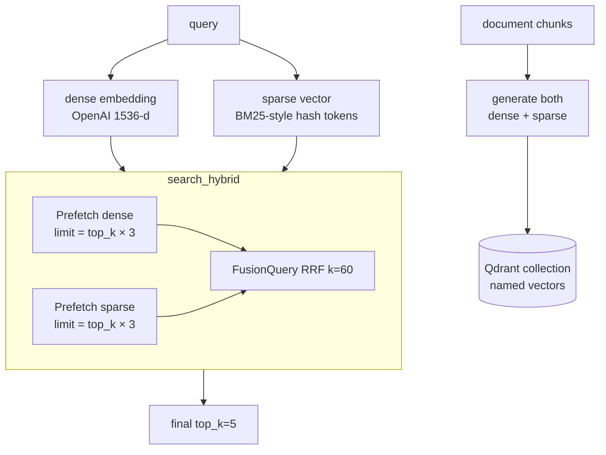

# #7 — Hybrid search (sparse vectors + RRF fusion)

## Parent PRD

#<prd-issue-number-tbd>

## What to build

Add the sparse-vector branch and RRF fusion to the existing dense-only retrieval from #5. The Qdrant collection migrates from a single dense vector to **dual vectors** (`{"dense": ..., "sparse": ...}`). All previously-uploaded docs are re-upserted with both representations. A new `search_hybrid` method runs `Prefetch` against both indexes (each pulling `top_k * 3` candidates) and fuses via Qdrant's server-side `Fusion.RRF` with `k=60`. The `search_mode` flag on `QueryRequest` exposes `"dense"`, `"sparse"`, `"hybrid"`; default `"hybrid"`.

After this slice, queries with rare keywords (order IDs, error codes, product SKUs) retrieve correctly when they previously missed.

## Topology

## Acceptance criteria

- [ ] `app/services/sparse_vector_service.py` — `generate_sparse_vector(text) -> SparseVector`. Lowercase, alphanumeric+hyphen tokenization (regex `\b[a-z0-9]+(?:-[a-z0-9]+)*\b`), 50-word stop-list removal, hashed `Counter` to sparse `{indices, values}`. Hash function deterministic (`abs(hash(token)) % 2**32`).
- [ ] `app/services/vector_store.py` — collection migration: drop & recreate as `{"dense": VectorParams(1536, COSINE), "sparse": SparseVectorParams()}`. New methods: `search_sparse(query_text, top_k)`, `search_hybrid(query_vector, query_text, top_k)`. Hybrid uses `Prefetch` + `FusionQuery(fusion=Fusion.RRF)`.
- [ ] All upserts now include both vectors. Re-ingest the 5 seed PDFs as part of the migration script.
- [ ] `QueryRequest` flag: `search_mode: Literal["dense", "sparse", "hybrid"] = "hybrid"`.
- [ ] `app/core/graph.py` — `vector_search` node reads `state["flags"]["search_mode"]` and dispatches to the right method.
- [ ] Unit tests: `tests/unit/services/test_sparse_vector_service.py` — same text → same indices (determinism), stop words removed, alphanumeric+hyphen handled.
- [ ] Unit tests: `tests/unit/services/test_vector_store.py` extended — hybrid search returns the expected RetrievedChunk shape; the call to Qdrant uses `Prefetch` + `FusionQuery` (assertable via mock).
- [ ] Integration test: upload a PDF with the literal string "order id 12345" in one chunk. Query *"order id 12345"* in `dense` mode → may miss; in `sparse` mode → hits; in `hybrid` mode → hits. Tests both branches.
- [ ] Eval (using #13 if landed, or manual): `recall@5` with `search_mode=hybrid` is ≥10pp higher than `dense` on the seed-set's 50 questions.

## Blocked by

- Blocked by #5 (collection exists, dense search works)

## User stories addressed

- 22 (hybrid search default; rare keywords retrieve correctly)

## Phase tag

`[phase-2]`.
