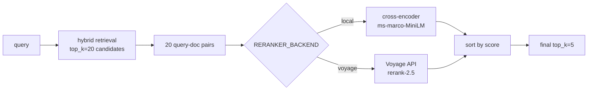

# #8 — Cross-encoder reranking (local + Voyage backends)

## Parent PRD

#<prd-issue-number-tbd>

## What to build

A pluggable reranking layer with two backends: a local `cross-encoder/ms-marco-MiniLM-L-6-v2` model (default, free, ~80MB, lazy-loaded) and a Voyage AI `rerank-2.5` API call (paid, higher quality). Selection by env (`RERANKER_BACKEND=local|voyage`). The retrieval pipeline switches to **two-stage**: pull a wide candidate set (`RERANKER_INITIAL_TOP_K=20`), then rerank down to the user's requested `top_k=5`.

`enable_rerank` flag on `QueryRequest` (default `True`). When false, retrieval pulls `top_k` directly with no rerank.

## Topology

## Acceptance criteria

- [ ] `app/services/reranking.py` — `RerankingBackend` ABC with `rerank(query, chunks, top_k) -> list[RetrievedChunk]`.
- [ ] `LocalRerankingBackend` — uses `sentence_transformers.CrossEncoder(settings.RERANKER_MODEL)`. Lazy-loaded (model loads on first call, not at app start).
- [ ] `VoyageRerankingBackend` — uses Voyage AI client with `rerank-2.5`. Reads `VOYAGE_API_KEY` env. Returns chunks reordered by `relevance_score`.
- [ ] Backend selection by `RERANKER_BACKEND` env (default `local`).
- [ ] `app/core/graph.py` — when `state["flags"]["enable_rerank"]` is true, `vector_search` retrieves with `top_k=settings.RERANKER_INITIAL_TOP_K` (default 20), then the new `rerank` node reduces to `state["flags"]["top_k"]` (default 5). When false, no rerank node, retrieve at `top_k` directly.
- [ ] `QueryRequest`: `enable_rerank: bool = True`.
- [ ] Unit tests: `tests/unit/services/test_reranking.py` — both backends produce sorted-by-score output; trivial sanity case (`"query about cats"` + `["cat doc", "dog doc"]` puts cat doc first); empty input returns empty.
- [ ] Integration test: same query with `enable_rerank=true` vs `false` — rerank changes ordering on at least one of the seed-set's hard questions.
- [ ] Latency: rerank adds <500ms p95 on a 20-candidate batch (local backend, CPU).
- [ ] Eval (#13): `enable_rerank=true` on top of hybrid lifts `context_precision` by ≥5pp on the seed set.

## Blocked by

- Blocked by #7 (hybrid search exists; rerank is a layer on top of any retrieval mode)

## User stories addressed

- 23 (cross-encoder reranking, opt-in for hard questions)

## Phase tag

`[phase-2]`.
