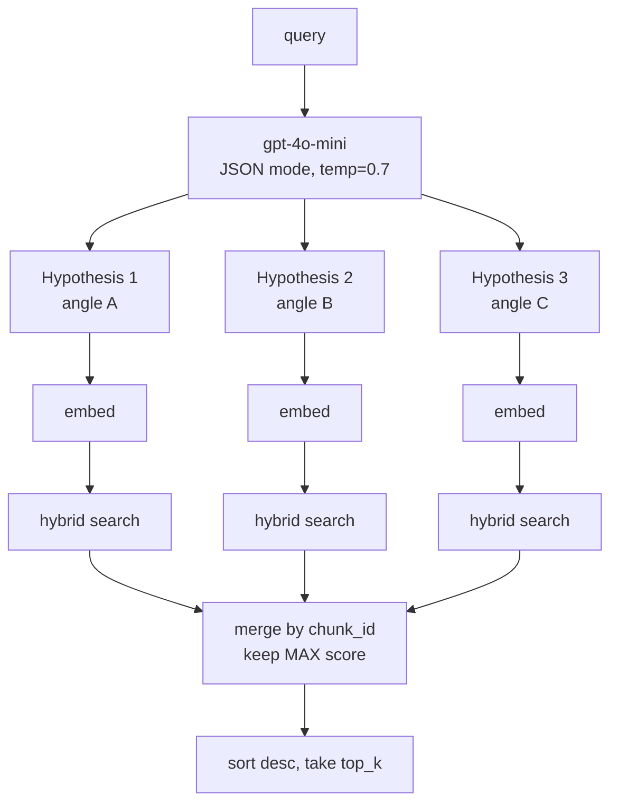

# #9 — HyDE multi-hypothesis retrieval

## Parent PRD

#<prd-issue-number-tbd>

## What to build

The "embed the answer, not the question" trick: given a query, ask `gpt-4o-mini` (JSON mode, temp=0.7) for **3 hypothetical answer-shaped passages**. Embed each, run hybrid search per hypothesis, merge results with **score-max** dedup (per `IMPLEMENTATION_PLAN.md` §0 row 20 + Doc 2 §5.5). When `enable_hyde=False` (default), this slice is dormant and behavior is identical to #7+#8.

## Topology

## Acceptance criteria

- [ ] `app/services/hyde.py` — `generate_hypothetical_documents(query, n=3) -> list[str]`. Uses `llm_service.generate_with_json` with the prompt from Doc 2 §5.3 verbatim (system message instructs to return `{"hypotheses": [..., ..., ...]}`).
- [ ] `app/core/graph.py` — new conditional node `hyde_or_passthrough`. When `flags.enable_hyde=True`, it generates N hypotheses, embeds each (one batched OpenAI call), runs `vector_store.search_hybrid` for each, merges + dedups, and writes the merged chunks to `state["retrieved_chunks"]`. When false, just embeds the original question.
- [ ] Merge implementation in `app/core/retrieval.py`: `_merge_and_deduplicate(all_results, top_k)` — by `chunk_id`, keep highest-scoring instance (NOT sum-of-scores).
- [ ] `QueryRequest`: `enable_hyde: bool = False`.
- [ ] `HYDE_NUM_HYPOTHESES` env (default 3); temperature env (default 0.7).
- [ ] Unit tests: `tests/unit/services/test_hyde.py` — 3 hypotheses parsed from JSON; temp + N passed through.
- [ ] Unit tests: `tests/unit/core/test_retrieval.py` — score-max merge: same chunk_id, keep max; different chunk_ids preserved; sorted desc.
- [ ] Integration test: a deliberately question-style query (*"why is X better than Y?"*) where the corpus contains answer-style prose. With `enable_hyde=False` recall is mediocre; with `enable_hyde=True` it improves measurably (manual eval on a hand-picked subset of 10 paraphrased questions).
- [ ] Latency: with HyDE on, `/query` adds 1 LLM call + 3× search. p95 latency budget for HyDE-on path is documented in README.

## Blocked by

- Blocked by #7 (hybrid search — HyDE multi-searches against it)

## User stories addressed

- 24 (HyDE for vague questions)

## Phase tag

`[phase-2]`.
