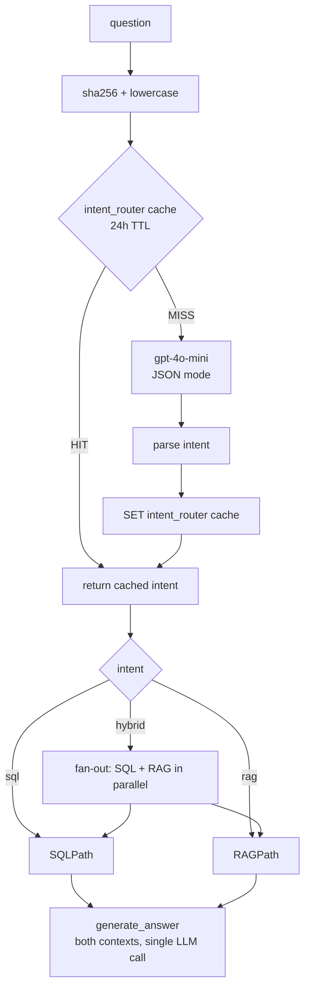

# #10 — LLM intent router (replaces Phase-1 stub)

## Parent PRD

#<prd-issue-number-tbd>

## What to build

Replace the keyword-trigger stub from #6 with a real `gpt-4o-mini` JSON-mode classifier. The router system prompt enumerates the available SQL tables (from `information_schema`) and the topics covered by uploaded docs (from a Qdrant payload aggregation or a static summary), giving the model the grounding it needs to pick `sql` / `rag` / `hybrid`. Cached for 24h keyed by `sha256(question.lower())`.

This slice unlocks **HYBRID** queries — the user stories that need *"top 5 customers and their SLAs"* style cross-domain answers depend on the router correctly emitting `"hybrid"`.

## Topology

## Acceptance criteria

- [ ] `app/services/router_service.py` — `classify_intent(question) -> Literal["sql", "rag", "hybrid"]` using JSON mode. System prompt template:
  - Lists the SQL tables and a one-line description of each (built from `information_schema` at startup).
  - Lists the doc topics — for now, derived from `seed/docs/README.md` titles (`refund-policy`, `shipping-policy`, ...). For uploaded docs, this is a future improvement.
  - Returns `{"intent": "sql"|"rag"|"hybrid", "reasoning": "..."}`.
- [ ] Cached via `query_cache_service` (#14 caches all router outputs; before #14 lands, use a simple ad-hoc Redis SETEX wrapper that #14 will absorb). 24h TTL.
- [ ] `app/core/graph.py` — replace stub `route_intent` with `router_service.classify_intent`. The graph's `intent` conditional edge already supports the three labels from #6.
- [ ] HYBRID branch: graph fans out to both SQL (Vanna gen + interrupt) and RAG (vector search). Both sub-flows write to state. Final `generate_answer` reads both `sql_rows` and `spotlighted_context` and runs a single LLM call merging them per `IMPLEMENTATION_PLAN.md` §0 row 16.
- [ ] Citation rule extended: prompt instructs the model to cite either `[doc-name.pdf]` or `[query results]`.
- [ ] Unit tests: `tests/unit/services/test_router_service.py` — JSON output shape; cache hit avoids LLM call (assertable via mock); cache miss calls LLM once.
- [ ] Integration test (3 cases):
  - *"How many enterprise customers in Germany?"* → `sql`
  - *"What's our return policy for opened items?"* → `rag`
  - *"Show me the top 5 customers by revenue and the SLA we've promised them"* → `hybrid` → final answer cites both `[orders table]` (or similar) and `[sla.pdf]`-equivalent doc
- [ ] Eval (#13): router classifies ≥95% of seed-set questions correctly (manual review of 50).

## Blocked by

- Blocked by #5 (RAG path needs to exist for `rag` and `hybrid` branches)
- Blocked by #6 (SQL path needs to exist for `sql` and `hybrid` branches)

## User stories addressed

- 31 (HYBRID question type works end-to-end)
- 32 (HYBRID answers cite both data sources)
- 33 (HYBRID merge is single LLM call)

## Phase tag

`[phase-3]`.
