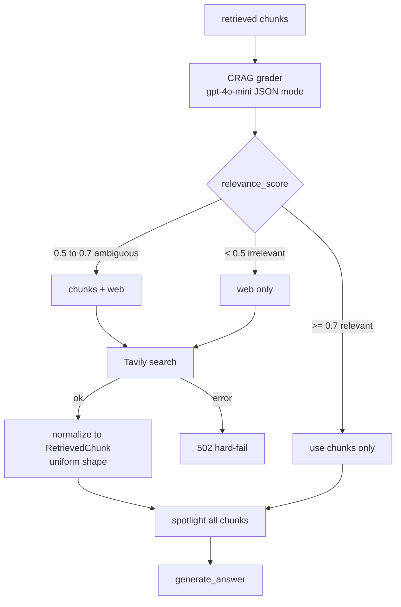

# #11 — CRAG grader + Tavily web fallback

## Parent PRD

#<prd-issue-number-tbd>

## What to build

The Corrective-RAG layer: between retrieval and generation, a JSON-mode grader scores the relevance of retrieved chunks against the query. Three-state output (`relevant` / `ambiguous` / `irrelevant`) drives a 3-way conditional edge:

- `relevant` (≥0.7) → use chunks only
- `ambiguous` (0.5–0.7) → use chunks **+** Tavily web supplement
- `irrelevant` (<0.5) → Tavily only

Tavily failures **hard-fail with 502** (per Q29 — no graceful degradation). All web results are normalized to the `RetrievedChunk` shape so downstream code (spotlighting, generation, Self-RAG) stays uniform.

## Topology

## Acceptance criteria

- [ ] `app/services/crag.py` — `evaluate_relevance(query, chunks) -> CRAGEvaluation`. JSON-mode call with the prompt from Doc 2 §4.2 verbatim. Returns `{relevance_score, relevance_label, confidence, reasoning}`.
- [ ] Thresholds from env: `CRAG_RELEVANCE_THRESHOLD=0.7`, `CRAG_AMBIGUOUS_THRESHOLD=0.5`.
- [ ] `app/services/web_search.py` — `WebSearchBackend` ABC with `search(query, max_results=3) -> list[WebResult]`. Tavily impl using `tavily-python`. **Tavily errors raise — they are NOT caught.** The route handler in `query.py` translates the exception to a 502 with the Tavily error message in the body.
- [ ] `app/services/crag.py` — `get_augmented_chunks(retrieved, web_results, label) -> list[RetrievedChunk]` per Doc 2 §4.4. Web results converted with `score=0.85` static, `metadata.file_type="web_search"`, `metadata.source_file=url`.
- [ ] `app/core/graph.py` — new node `crag_grade` runs after retrieval (and rerank if enabled). Conditional edge with three labels. New nodes `tavily_search` and `merge_with_web`. Spotlighting node consumes the augmented chunk list — no changes to `spotlighting.py`.
- [ ] `QueryRequest`: `enable_crag: bool = True`.
- [ ] When `enable_crag=False`, the graph skips the grader and Tavily entirely (legacy path from #5/#7).
- [ ] Context assembly differs by label per Doc 2 §4.5 (use the correct delimiter labels in the prompt).
- [ ] Unit tests: `tests/unit/services/test_crag.py` — three-state classification at thresholds; web→RetrievedChunk normalization; `get_augmented_chunks` produces the right combination per label.
- [ ] Integration test: query *"What's the tracking status of order 1Z999AA10123456784?"* (intentionally not in seed docs) with `enable_crag=true` → grader returns `irrelevant` → Tavily fires → answer cites web URL.
- [ ] Failure test: temporarily revoke `TAVILY_API_KEY` → query that triggers fallback → 502 with Tavily error in body. Logs include full Tavily error context.

## Blocked by

- Blocked by #5 (CRAG operates on retrieved chunks; needs RAG path to exist)

## User stories addressed

- 25 (CRAG-style fallback to web)
- 28 (Tavily failure → 502 hard-fail)

## Phase tag

`[phase-3]`.
