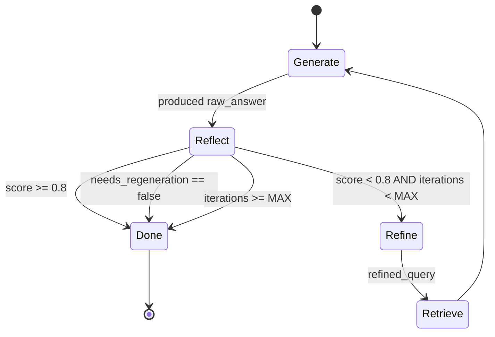

# #12 — Self-RAG cyclic reflect-refine

## Parent PRD

#<prd-issue-number-tbd>

## What to build

The bounded reflection loop: after `generate_answer`, a `reflect` node calls `gpt-4o-mini` in JSON mode to grade the answer against its sources (`reflection_score` 0..1). If score ≥ `REFLECTION_MIN_SCORE` (0.8), graph terminates. Otherwise — and if `reflection_iterations < MAX_REFLECTION_RETRIES` (2) — a `refine_query` node generates a refined question, the graph cycles back to `hyde_or_passthrough`/retrieval (per `IMPLEMENTATION_PLAN.md` §11.3), and another iteration begins.

The cycle is bounded **by the conditional edge**, not by Python control flow — that's the whole point of using LangGraph for this.

## Topology

## Acceptance criteria

- [ ] `app/services/self_reflective.py` — `reflect_on_answer(query, answer, chunks) -> ReflectionResult` (JSON mode, schema per Doc 2 §3.2). Fields: `answer_grounded`, `hallucination_detected`, `reflection_score`, `sources_cited`, `needs_regeneration`, `reflection_reason`.
- [ ] `_refine_query(original, reflection) -> str` (Doc 2 §3.5 verbatim prompt).
- [ ] `app/core/graph.py` — new nodes `reflect` and `refine_query`. Conditional edge: `reflect` → `refine_query` (if score < threshold AND iterations < max AND needs_regeneration) ELSE `finalize`. `refine_query` → back to `hyde_or_passthrough` (or `vector_search` if HyDE off). `state["reflection_iterations"]` incremented at the top of each refine.
- [ ] Self-RAG interleaves with CRAG (#11) per Doc 2 §8: refinement re-runs CRAG too — the conditional edge from `refine_query` lands at `hyde_or_passthrough` and the existing flow downstream re-runs `crag_grade` and `tavily_search` if needed.
- [ ] `QueryRequest`: `enable_self_reflective: bool = False` (default off — cost reasons per `IMPLEMENTATION_PLAN.md` §0 row 20).
- [ ] Bounded retries: even if every reflection scores 0.0, the loop terminates after `MAX_REFLECTION_RETRIES + 1` total generations and returns the last attempt.
- [ ] Unit tests: `tests/unit/services/test_self_reflective.py` — bounded-retries invariant (force a mock to always return 0.5; assert exactly `MAX_REFLECTION_RETRIES + 1` generations); reflection JSON parse; refinement prompt shape.
- [ ] Integration test: an intentionally underspecified query (*"What's the policy for that situation?"*) with `enable_self_reflective=true` triggers at least one refinement before terminating.
- [ ] Integration test (cost ceiling): same query with `enable_self_reflective=true` and a mocked LLM that always scores 0.0 → graph terminates after 3 generations total, never hangs.
- [ ] LangGraph mermaid (live diagram) shows the cyclic edge from `refine_query` back to retrieval.

## Blocked by

- Blocked by #5 (graph + RAG path; the cycle re-uses retrieval)

## User stories addressed

- 26 (Self-RAG refines on hard questions)
- 27 (`MAX_REFLECTION_RETRIES` strictly bounds the loop)

## Phase tag

`[phase-3]`.
