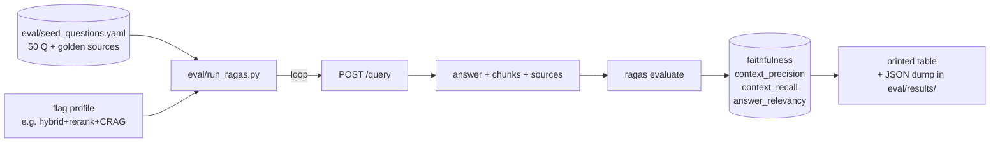

# #13 — Eval harness (Ragas + 50 seed questions + `make eval`)

## Parent PRD

#<prd-issue-number-tbd>

## What to build

A repeatable quality measurement so you can tell whether HyDE / rerank / CRAG / Self-RAG are actually helping. 50 hand-written questions in `eval/seed_questions.yaml` with golden source files. `eval/run_ragas.py` runs each against `/query` (with chosen flags) and computes Ragas metrics: `faithfulness`, `context_precision`, `context_recall`, `answer_relevancy`. A `make eval` target runs the harness and prints a table.

**Not wired into CI** (decision Q30) — runs manually before each phase tag.

## Topology

## Acceptance criteria

- [ ] `eval/seed_questions.yaml` — 50 entries each with `{id, question, intent (sql|rag|hybrid), golden_sources: [filenames or "query results"], notes?}`. Cover all 5 seed PDFs + the e-commerce schema. Intent mix roughly: 20 RAG, 15 SQL, 10 HYBRID, 5 web-fallback (CRAG).
- [ ] `eval/run_ragas.py` — argparse for `--flags` (e.g. `--enable-hyde --enable-rerank --enable-crag`); loops over seed Qs; calls `/query` against a running local stack with a system token; for SQL/HYBRID, auto-approves the `pending_sql` block; collects answers + retrieved contexts; runs `ragas.evaluate` on the dataset.
- [ ] Output: a markdown table on stdout + a timestamped JSON file in `eval/results/`. Diff helper: `eval/diff.py prev.json curr.json` shows per-metric deltas.
- [ ] `Makefile` target: `eval` runs `python eval/run_ragas.py --flags '{...}'` with the default flag profile.
- [ ] README documents: how to run eval, the acceptance thresholds (`faithfulness ≥ 0.85`, `context_precision ≥ 0.75`), and the practice of running eval before each phase tag.
- [ ] Unit test: `tests/unit/eval/test_seed_yaml.py` validates the YAML schema (id uniqueness, intent enum, golden_sources non-empty).
- [ ] Acceptance run: with the post-#9 flag profile (hybrid+rerank, no HyDE/CRAG/Self-RAG), the seed eval runs to completion in <10 min and produces a results JSON.
- [ ] Pre-#10 sanity: SQL questions in the seed set pass with `intent` filled in manually (since the LLM router lands in #10). Once #10 lands, the harness stops needing manual intent overrides.

## Blocked by

- Blocked by #5 (RAG path runnable)
- Blocked by #6 (SQL path runnable)

## User stories addressed

- 57 (eval runnable via `make eval`)

## Phase tag

`[cross-cutting]`. Ship anytime after #5+#6; revisit in each later phase to verify acceptance thresholds.
