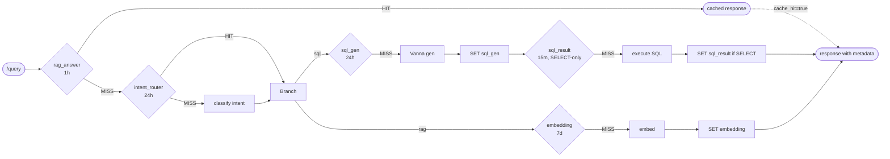

# #14 — 4-tier Redis cache + intent_router cache + `cache_hit`/`cost_saved` + `/admin/cache/stats`

## Parent PRD

#<prd-issue-number-tbd>

## What to build

The Upstash Redis caching layer that wraps every expensive call. Five cache namespaces, each with its own TTL (per `IMPLEMENTATION_PLAN.md` §0 row 21):

| Cache | Key | TTL | When |
|-------|-----|-----|------|
| `rag_answer:<sha256(q)+flag-bitmap>` | full ChatResponse | 1h | top of `/query` graph |
| `sql_gen:<sha256(q)>` | generated SQL string | 24h | inside `vanna_generate_sql` |
| `sql_result:<sha256(normalized SQL)>` | SELECT rows | 15m, SELECT-only | inside `execute_sql` |
| `embedding:<sha256(text)>` | 1536 floats | 7d | inside `embedding_service.embed_*` |
| `intent_router:<sha256(q.lower())>` | intent label | 24h | inside `router_service` |

Every response gets `cache_hit: bool` and `cost_saved: "$0.05"` populated by whichever tier hit (or `false / "$0.00"`). `/admin/cache/stats` returns per-cache hit/miss counts.

## Topology

## Acceptance criteria

- [ ] `app/services/query_cache_service.py` — `QueryCacheService` with methods per cache type (`get_rag_answer`, `set_rag_answer`, ..., `get_embedding`, `set_embedding`). Internal stats dict per cache type.
- [ ] Key shape: `{namespace}:{sha256_hex}` (or `{namespace}:{sha256_hex}:{top_k}` for variants that include retrieval params). Embedding key is sha256 of text only — model-name change requires a manual flush (documented).
- [ ] Wire calls:
  - `app/core/graph.py` — first node is a cache-check that sets `state["rag_answer_cache_hit"]` and short-circuits to END if hit.
  - `app/services/embedding_service.py` — batched cache-miss flow per Doc 1 §4.7 (skip hits, batch misses into one OpenAI call).
  - `app/services/sql_service.py` — wraps `generate_sql` with `sql_gen` cache.
  - `app/core/graph.py` `execute_sql` node — wraps DB call with `sql_result` cache (SELECT-only check before SET).
  - `app/services/router_service.py` (from #10) — already had ad-hoc cache; replace with `query_cache_service` calls.
- [ ] Every cache SET fires-and-forgets — Redis errors are logged but never fail the request.
- [ ] `cache_hit: bool` in every `ChatResponse` reflects the *outermost* hit (rag_answer hit overrides any inner-tier accounting).
- [ ] `cost_saved` populated with the rough dollar figure of the operation skipped (per `IMPLEMENTATION_PLAN.md` cost frame in Doc 1 §1).
- [ ] `app/api/admin.py` — `GET /admin/cache/stats` (Bearer + `is_admin=true`) returns `{embedding: {hits, misses, hit_rate}, rag_answer: {...}, ...}`.
- [ ] All cache TTLs configurable via env (`CACHE_TTL_*` from `IMPLEMENTATION_PLAN.md` §4).
- [ ] Unit tests: `tests/unit/services/test_query_cache_service.py` — key shape, TTL set per cache, stats incremented per hit/miss, fire-and-forget on Redis error.
- [ ] Integration test: ask the same RAG question twice — second call returns `cache_hit=true`, p50 latency ≤ 500ms (warm cache target from `IMPLEMENTATION_PLAN.md` §3 Phase 4 acceptance).
- [ ] Integration test (cache hit rate): 1000 calls with 10 unique questions × 100 repeats — hit rate >50% after warm-up.
- [ ] Integration test (DML never cached): execute an `UPDATE` (forced via direct `execute_sql` node test) — no `sql_result` SET.
- [ ] `/admin/cache/stats` reports non-zero hits after a few warm-up calls.

## Blocked by

- Blocked by #5 (RAG path)
- Blocked by #6 (SQL path)
- Blocks #18 (AWS deployment uses the cache stats endpoint for smoke tests)

## User stories addressed

- 17 (`sql_gen` 24h)
- 18 (`sql_result` 15m, SELECT-only)
- 29 (`rag_answer` 1h, key includes flag bitmap)
- 30 (`embedding` 7d)
- 51 (`cache_hit` + `cost_saved` in response)
- 52 (`/admin/cache/stats`)
- 53 (TTLs configurable via env)

## Phase tag

`[phase-4]`.
