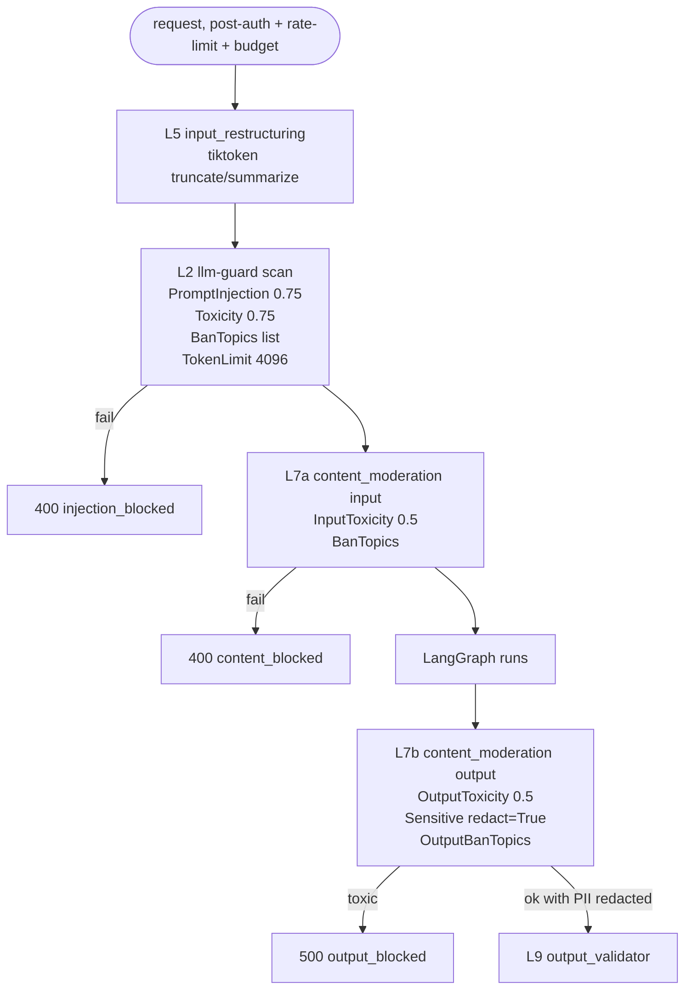

# #16 — llm-guard L2 + content moderation L7 + input restructuring L5

## Parent PRD

#<prd-issue-number-tbd>

## What to build

Three security layers that all live as middleware around the LangGraph (per `IMPLEMENTATION_PLAN.md` §11.1 — they're stateless gates, not graph nodes):

- **L2 llm-guard scanners** — `PromptInjection(0.75)`, `Toxicity(0.75)`, `BanTopics([...])`, `TokenLimit(4096)`. Catches the semantic-injection cases that L1 regex misses.
- **L7 content moderation** — input side (`InputToxicity`, `BanTopics`) and output side (`OutputToxicity`, `Sensitive(redact=True)`, `OutputBanTopics`). The killer feature is `Sensitive(redact=True)`, which auto-redacts emails/phones/credit cards/IPs in LLM output.
- **L5 input restructuring** — `tiktoken`-based truncate (when input is moderately too long) or summarize (when grossly too long). Method (`original|truncated|summarized`) returned in response metadata.

After this slice, the full 9-layer stack is live.

## Topology

## Acceptance criteria

- [ ] `app/security/input_guard.py` — `scan_input(prompt) -> (is_safe, sanitized, failed_checks, scores)`. Wraps `llm_guard.scan_prompt` with the four scanners. Thresholds from env (`PROMPT_INJECTION_THRESHOLD=0.75`, etc.). `BanTopics` list from env or constant: `["violence", "self-harm", "illegal activities"]`.
- [ ] `app/security/content_moderation.py` — `moderate_input(text) -> (is_safe, sanitized, failed)` and `moderate_output(prompt, llm_output) -> (is_safe, sanitized, failed)`. Output-side includes `Sensitive(redact=True)` with PII categories (email, phone, credit_card, ip).
- [ ] `app/security/input_restructuring.py` — `restructure_input(message, max_tokens=3000, context_tokens=1000) -> (text, method)` per Doc 5 §3 L5 verbatim decision tree. Returns method label.
- [ ] `app/api/query.py` — middleware order: auth → rate limit → budget check → restructure → llm-guard → input moderation → graph → output moderation → output validate → budget consume.
- [ ] `ChatResponse.metadata.input_restructure_method` populated.
- [ ] LLM-guard models load lazily on first request (don't slow down container startup).
- [ ] Output moderation runs on the **graph's raw answer** before output_validator (so PII is redacted *before* schema validation; schema sees `[REDACTED_EMAIL]` not the real email).
- [ ] Unit tests:
  - `test_input_guard.py` — passes a known prompt-injection string; scanner flags; threshold tuning works.
  - `test_content_moderation.py` — input toxicity rejected; output PII auto-redacted (email → `[REDACTED_EMAIL]`); BanTopics blocks.
  - `test_input_restructuring.py` — three branches fire on the right token-count buckets; method label correct.
- [ ] Integration test: jailbreak corpus (10+ templates from `tests/security/`) — every variant blocked at L1, L2, or L7, with the rejection layer captured in the test assertion.
- [ ] Integration test: a query that retrieves a customer record (containing `email='alice@example.com'`) → response answer contains `[REDACTED_EMAIL]`, never `alice@example.com`.
- [ ] Integration test: 50KB pasted message → response metadata `input_restructure_method = "truncated"`. 500KB → `summarized`.
- [ ] Latency: L2 + L7 add <300ms p95 (CPU-only).

## Blocked by

- Blocked by #4 (graph + middleware shape established)
- Blocks #18 (AWS deployment exercises the security stack)

## User stories addressed

- 43 (PII auto-redaction)
- 44 (input >3000 truncated, >6000 summarized)
- 47 (semantic prompt injection blocked)
- 48 (BanTopics + toxicity blocked)
- 49 (jailbreak corpus regression)
- 50 (indirect injection in seed PDF doesn't influence answers — exercised via this slice's tests)

## Phase tag

`[phase-4]`.
