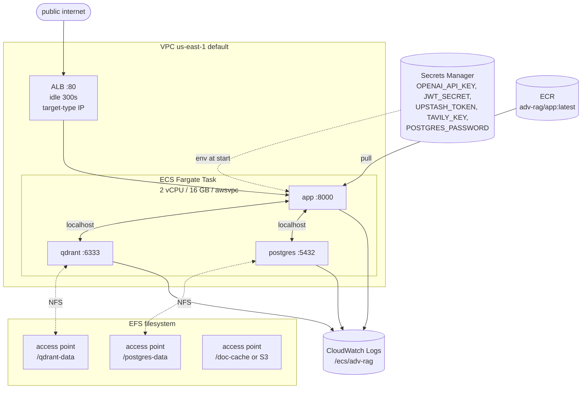

# #18 — AWS infra setup (ECR + ECS task def + EFS APs + ALB + Secrets Manager)

## Parent PRD

#<prd-issue-number-tbd>

## Slice type: HITL

This slice **requires human-in-the-loop interaction with the AWS Console / CLI**: AWS account ID, region selection, IAM trust policy creation, Secrets Manager values input, EFS access-point creation, ALB listener config. The artifacts (`app-task-def.json`, `cicd-policy.json`, infra setup script) are committed; the actual AWS state is provisioned manually with the script as a guide.

## What to build

A working production-shape deployment of the full stack on AWS, single ECS Fargate task with three sidecar containers (app, qdrant, postgres), persistent state on EFS access points, secrets injected from Secrets Manager, traffic via ALB. No CD yet — that's #19. This slice gets you to "I can `docker push` an image and `aws ecs update-service --force-new-deployment` and the service comes up."

## Topology

## Acceptance criteria

- [ ] `infra/app-task-def.json` — full ECS task definition matching `IMPLEMENTATION_PLAN.md` §3 Phase 5. CPU 2048, memory 16384, awsvpc network mode, FARGATE compatibility.
- [ ] Three container definitions: `app` (from ECR `:latest`), `qdrant` (`qdrant/qdrant:v1.17.0`), `postgres` (`postgres:16`). Each with `awslogs` log driver, `healthCheck` stanza, port mapping.
- [ ] Three EFS volumes + access points wired via `efsVolumeConfiguration` per container's `mountPoints`:
  - `qdrant-data` → `/qdrant/storage`
  - `postgres-data` → `/var/lib/postgresql/data`
  - `doc-cache` (optional; alternative is S3 — `STORAGE_BACKEND=s3` is the recommended prod default per `IMPLEMENTATION_PLAN.md` §3 Phase 5)
- [ ] Secrets injected via `secrets[].valueFrom` ARNs against Secrets Manager: `OPENAI_API_KEY`, `JWT_SECRET`, `UPSTASH_REDIS_TOKEN`, `TAVILY_API_KEY`, `POSTGRES_PASSWORD`, `VOYAGE_API_KEY` (optional). One secret per env var; ARNs noted in `infra/secrets.md`.
- [ ] `infra/cicd-policy.json` — minimum IAM policy for the deployer (ECR push, ECS update, `iam:PassRole` scoped to the task execution role).
- [ ] `infra/setup.sh` — script that creates ECR repo, EFS filesystem, EFS access points (with the right UID/GID), Secrets Manager secrets, ECS cluster, ALB + target group, listener, task definition, service. Idempotent where AWS allows. **HITL:** AWS account ID, region, domain, image tag are inputs; the script doesn't bake them in.
- [ ] ALB target group: target type `IP`, port `8000`, health check `GET /admin/health` every 30s, idle timeout `300s`.
- [ ] **Postgres-on-EFS caveat documented** in `infra/README.md` (per `IMPLEMENTATION_PLAN.md` §3 Phase 5) — fsync / locking caveats; `RDS migration` flagged as a future PRD.
- [ ] `routes/health.py` enhanced to also ping RDS / Postgres-sidecar URL, Upstash token, OpenAI mini-embed call. Fast (~1s budget). Sets `status: "ok|degraded"`.
- [ ] `LOG_JSON=true` in the prod task def so CloudWatch Logs Insights can query.
- [ ] Manual smoke test: `aws ecs update-service ... --force-new-deployment`, wait for `runningCount==desiredCount`, then `curl https://<alb-dns>/admin/health` → 200, then run an authenticated `/query` end-to-end.
- [ ] EFS persistence test: `aws ecs update-service ... --force-new-deployment` again (replaces the task). After replacement, all uploaded docs are still queryable, all DB rows still present.
- [ ] Secret rotation test: rotate `OPENAI_API_KEY` in Secrets Manager → force-deploy → service picks up new value (verifiable via response error if the old key is revoked first).

## Blocked by

- Blocked by #14 (cache stats endpoint exercised in smoke test)
- Blocked by #16 (security stack live in prod)
- Blocked by #17 (seed PDFs ingested in deployed instance)

## User stories addressed

- 54 (structured JSON logs in prod)
- 55 (per-layer rejection visible in CloudWatch)
- 70 (EFS persistence across task replacement)
- 71 (secret rotation without code change)
- 72 (ALB idle timeout 300s)

## Phase tag

`[phase-5]`.
