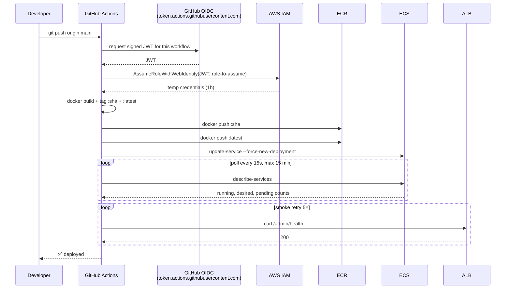

# #19 — GitHub Actions CD with OIDC

## Parent PRD

#<prd-issue-number-tbd>

## Slice type: HITL

**Requires human-in-the-loop AWS Console / CLI work** for the OIDC trust setup: creating an OIDC identity provider in IAM (`token.actions.githubusercontent.com`), authoring the trust policy that scopes role-assumption to your specific GitHub `org/repo:ref:refs/heads/main`, and attaching the deployer policy from #18.

## What to build

`.github/workflows/cd.yml` triggered on push to `main`, builds the image, pushes both `:sha` and `:latest` tags to ECR, calls `aws ecs update-service --force-new-deployment`, polls until `runningCount == desiredCount` (or fails after 15 min), runs a smoke test against `/admin/health`. Auth is **OIDC**, not static keys (per `IMPLEMENTATION_PLAN.md` §3 Phase 5 and Doc 3 §5.2 gap fix).

## Topology

## Acceptance criteria

- [ ] `.github/workflows/cd.yml` triggered on `push` to `main` (only the `main` branch — feature branches use `ci.yml` from #1).
- [ ] `permissions: { id-token: write, contents: read }` set on the job.
- [ ] `aws-actions/configure-aws-credentials@v4` with `role-to-assume: arn:aws:iam::<acct>:role/github-actions-adv-rag-deployer` (no static keys).
- [ ] `aws-actions/amazon-ecr-login@v2` for ECR auth.
- [ ] Build + tag both `:${{ github.sha }}` and `:latest`. Push both.
- [ ] `aws ecs update-service --cluster ... --service ... --force-new-deployment`.
- [ ] Wait loop polling `aws ecs describe-services` every 15s until `running == desired AND pending == 0`. Bail at 60 iterations (15 min) with workflow failure.
- [ ] Smoke test: `curl https://<ALB-DNS>/admin/health` 5× with backoff; first 200 wins; all-fail fails the workflow.
- [ ] `infra/oidc-trust-policy.json` — IAM trust policy template scoped to `repo:<org>/<repo>:ref:refs/heads/main`. Documented in `infra/README.md` how to install (one-time AWS IAM Console steps).
- [ ] `infra/deployer-role-policy.json` — the IAM policy attached to the OIDC-assumable role. Permissions per `cicd-policy.json` from #18.
- [ ] **No `AWS_ACCESS_KEY_ID` / `AWS_SECRET_ACCESS_KEY` in GitHub Secrets.** The workflow file must not reference them.
- [ ] On smoke-test failure, workflow fails (not "succeeded with warnings"). Rollback procedure documented in `infra/README.md`: `git revert <sha> && git push` re-triggers CD with the previous image.
- [ ] Acceptance test: `git push origin main` with a no-op change → workflow goes green within 15 min → `/admin/health` is 200 against the ALB DNS.
- [ ] Acceptance test (rollback): push a deliberately-broken change (e.g. break `/admin/health`) → smoke test fails → workflow red → `git revert` + push → workflow green → service back.

## Blocked by

- Blocked by #18 (ECR + ECS + ALB exist and are deploy-ready)

## User stories addressed

- 67 (PRD/issues land on GitHub — implicit via the repo+remote being live)
- 68 (`git push origin main` triggers CD)
- 69 (OIDC instead of static keys)

## Phase tag

`[phase-5]`. Eligible for `phase-5-aws` milestone (along with #18).
