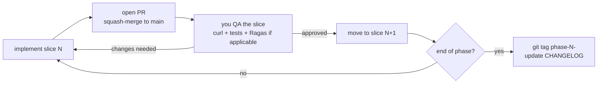

# Issue Index — ADV RAG

> Generated by `/prd-to-issues` from [`PRD.md`](../PRD.md).
> Repo + GitHub remote don't exist yet. Once they do (during `IMPLEMENTATION_PLAN.md` §9 first-commit checklist), use:
>
> ```bash
> # First, create the parent PRD issue:
> gh issue create --title "PRD: ADV RAG E-commerce Customer Support Copilot" --body-file ../PRD.md
> # Note the issue number it returns — say it's #1. Then update the "Parent PRD" line in each
> # issue file below to "#1", and create the slice issues in dependency order:
> for f in 0001-*.md 0002-*.md ... 0019-*.md; do
>   gh issue create --title "$(head -1 "$f" | sed 's/^# //')" --body-file "$f"
> done
> ```

## Workflow

**All 19 slices are HITL** (Human-in-the-Loop): each slice gets a QA review before the next starts. You give real-time feedback; I revise; we tag the phase milestone when done.



## Slices in dependency order

| # | Title | Phase tag | Blocks | User stories |
|---|-------|-----------|--------|--------------|
| 1 | [Repo scaffold + `/admin/health`](0001-repo-scaffold.md) | phase-1 | #2 | 56, 62, 63, 65 |
| 2 | [Auth foundation](0002-auth-foundation.md) | phase-0 | #3 | 1, 2, 3, 4, 6 |
| 3 | [Rate limit + token budget](0003-rate-limit-token-budget.md) | phase-0 | #4 | 5, 7, 8 |
| 4 | [LangGraph skeleton + I/O validation + spotlighting](0004-langgraph-skeleton.md) | phase-0+1 | #5, #6, #16 | 9, 10, 42, 45, 46, 58, 60, 61 |
| 5 | [Naïve RAG path](0005-naive-rag-path.md) | phase-1 | #7, #10, #11, #12, #13, #14, #15, #17 | 20, 21, 34, 37, 39, 40, 41 |
| 6 | [SQL path via `interrupt()`](0006-sql-path-interrupt.md) | phase-1 | #10, #13, #14 | 11–16, 19, 59 |
| 7 | [Hybrid search](0007-hybrid-search.md) | phase-2 | #8, #9 | 22 |
| 8 | [Cross-encoder rerank](0008-cross-encoder-rerank.md) | phase-2 | — | 23 |
| 9 | [HyDE multi-hypothesis](0009-hyde.md) | phase-2 | — | 24 |
| 10 | [LLM intent router](0010-llm-intent-router.md) | phase-3 | — | 31, 32, 33 |
| 11 | [CRAG + Tavily fallback](0011-crag-tavily.md) | phase-3 | — | 25, 28 |
| 12 | [Self-RAG cyclic edge](0012-self-rag.md) | phase-3 | — | 26, 27 |
| 13 | [Eval harness (Ragas)](0013-eval-harness.md) | cross-cutting | — | 57 |
| 14 | [Redis cache tiers + stats](0014-redis-cache-tiers.md) | phase-4 | #18 | 17, 18, 29, 30, 51, 52, 53 |
| 15 | [Document dedup cache](0015-document-dedup.md) | phase-4 | — | 39 |
| 16 | [llm-guard + moderation + restructure](0016-llm-guard-moderation.md) | phase-4 | #18 | 43, 44, 47, 48, 49, 50 |
| 17 | [PDF upload security pipeline](0017-pdf-upload-security.md) | phase-4 | #18 | 35, 36, 38 |
| 18 | [AWS infra setup](0018-aws-infra-setup.md) | phase-5 | #19 | 54, 55, 70, 71, 72 |
| 19 | [GitHub Actions CD with OIDC](0019-github-actions-cd.md) | phase-5 | — | 67, 68, 69 |

## Phase milestones

- **`phase-0-baseline`** — after #2, #3, #4 acceptance criteria pass.
- **`phase-1-skeleton`** — after #1, #5, #6 acceptance criteria pass.
- **`phase-2-retrieval`** — after #7, #8, #9.
- **`phase-3-self-correct`** — after #10, #11, #12, #13.
- **`phase-4-cache-harden`** — after #14, #15, #16, #17.
- **`phase-5-aws`** — after #18, #19.
